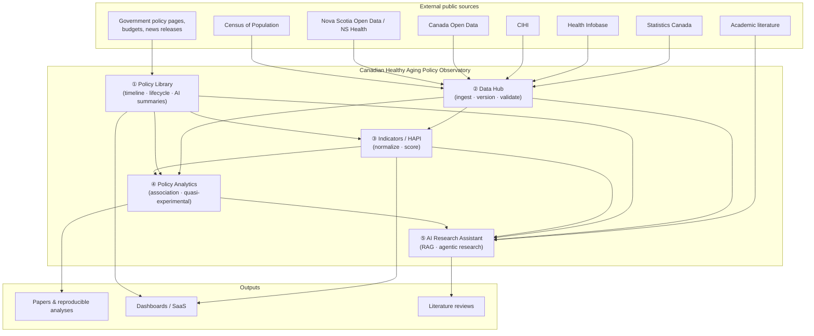
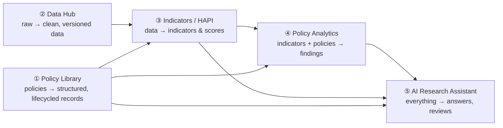

# 01 — Platform Overview

## 中文概览

本文给出平台的整体视图:五个模块如何协同、系统上下文(谁向平台输入、平台向谁输出)、以及三类用户角色。

- **五模块协同**:Data Hub 持续吸纳公开数据 → Policy Library 维护带生命周期的政策记录 → Indicators(HAPI)把数据归一化成指标与评分 → Policy Analytics 在政策与指标之间做(谨慎的)关联/准实验分析 → AI Research Assistant 在以上全部之上做检索增强问答与文献综述。
- **数据流主线**:`外部公开数据 + 政策原文 → 入库与版本化 → 指标化/评分 → 分析 → AI 辅助研究 → 论文/看板/SaaS`。
- **三类用户**:研究者(作者本人及合作者)、政策制定者/分析师、公众/媒体。v1 以研究者为主。

---

## 1. System context

The observatory sits between **public data sources** on one side and **research/decision outputs** on the other. It ingests, structures, measures, and reasons.



## 2. How the five modules fit together

The modules form a layered pipeline. Each layer depends on the ones beneath it and adds a distinct kind of value.



- **① Policy Library** is the *qualitative* spine: what was decided, by whom, when, with what money and targets. Each record has a lifecycle (announced → funded → in effect → amended → retired). See [`04-module-policy-library.md`](04-module-policy-library.md).
- **② Data Hub** is the *quantitative* spine: trustworthy, versioned, lineage-tracked data from public sources. It is the most important part of the platform because everything downstream inherits its credibility. See [`05-module-data-hub.md`](05-module-data-hub.md).
- **③ Indicators / HAPI** turns raw data into **comparable, normalized indicators** and the composite **Healthy Aging Policy Index**. This is the platform's independent yardstick. See [`06-module-indicators-hapi.md`](06-module-indicators-hapi.md).
- **④ Policy Analytics** asks questions *across* policies and indicators ("did home-care investment move ER visits?") with explicit causal-inference discipline. See [`07-module-policy-analytics.md`](07-module-policy-analytics.md).
- **⑤ AI Research Assistant** sits on top of all of it: retrieval-augmented question answering, evidence gathering, and literature-review drafting, always cited and traceable. See [`08-module-ai-research-assistant.md`](08-module-ai-research-assistant.md).

## 3. The end-to-end data flow

```
External public data + policy text
        │  ingest, clean, version (Data Hub)
        ▼
Structured records + observations  ──►  Policy Library (lifecycled policy records)
        │  normalize, score (Indicators / HAPI)
        ▼
Indicators & HAPI scores
        │  associate, model (Policy Analytics)
        ▼
Findings (with stated confidence & method)
        │  retrieve, synthesize (AI Research Assistant)
        ▼
Papers · Dashboards · Literature reviews · SaaS
```

## 4. User roles

| Role | Needs | v1 priority |
|------|-------|-------------|
| **Researcher** (the author + collaborators) | Reproducible data, defensible indicators, analysis scaffolding, literature-review acceleration | **Primary** |
| **Policy maker / analyst** | Clear dashboards, jurisdiction comparisons, "what changed and did it work?" | Secondary |
| **Public / media** | Accessible summaries, trends, transparency | Later |

v1 is built **researcher-first**. The dashboards and SaaS surfaces that serve policy makers and the public are downstream of a credible research core — so we build the core first.

## 5. Geographic scope (v1)

```
Canada
 ├── Federal
 └── Nova Scotia
```

Nova Scotia + Federal is the v1 template. Ontario, BC, and other provinces slot into the same jurisdiction tree and data model without schema changes (see [`03-data-model.md`](03-data-model.md)).

## 6. What is explicitly *not* in v1

- No application code or live ingestion yet — this stage delivers the design only.
- No causal claims asserted as settled fact; the analytics module is a *framework* with guardrails, not a verdict generator.
- No personal or identifiable data — the platform uses aggregate public data only (see privacy notes in [`02-architecture.md`](02-architecture.md)).
