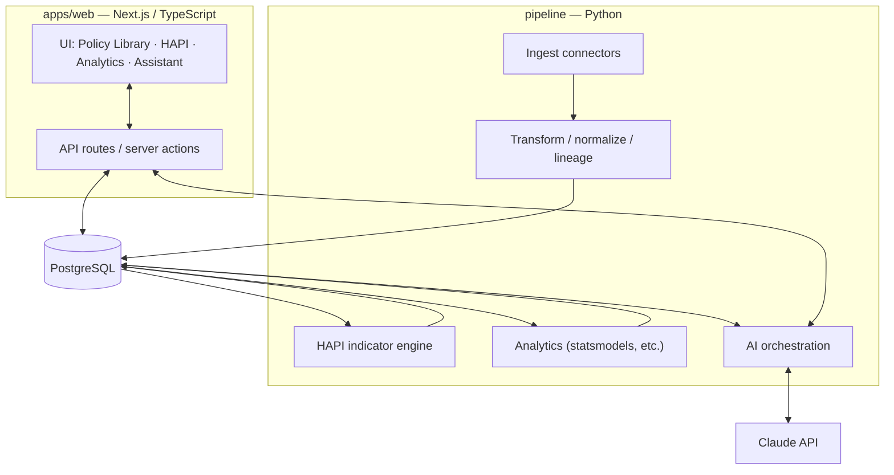
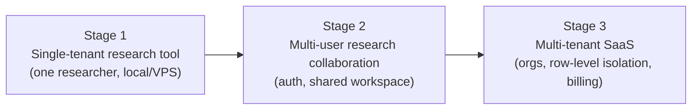

# 02 — Architecture

## 中文概览

本文确定技术栈、代码库结构与演进路径。

- **技术栈**:前端/看板用 **Next.js (TypeScript)**;数据采集/ETL/统计分析用 **Python**;存储用 **PostgreSQL**;AI 层封装 **Claude API**。理由:前端生态与 SaaS 落地选 TS,而数据科学/统计/抓取生态选 Python,两者各取所长,通过数据库与明确的契约解耦。
- **代码库**:单一 monorepo —— `apps/web`(Next.js)、`pipeline`(Python 采集与分析)、`db`(schema 与迁移)、`packages`(共享类型/契约)、`docs`(本白皮书)。
- **本地开发**:`docker-compose` 起 Postgres;Python 与 Next.js 各自常规工具链。
- **演进路径**:单租户研究工具 → 多用户研究协作 → 多租户 SaaS。预留鉴权、行级隔离、计费的接入点。
- **隐私合规**:平台只用**聚合的公开数据**,不含个人可识别信息;但仍按 PIPEDA / 加拿大隐私原则记录数据来源与许可证。

---

## 1. Stack at a glance

| Layer | Technology | Why |
|-------|-----------|-----|
| Frontend & dashboards | **Next.js (TypeScript)** | Best-in-class web UI + SSR; a natural path to a SaaS product; strong charting ecosystem (e.g. Recharts/visx/ECharts) |
| Data pipeline, ETL, statistics | **Python** | The data-science, statistics, and scraping ecosystem (pandas, requests, statsmodels, etc.) is unmatched; quasi-experimental methods live here |
| Storage | **PostgreSQL** | Relational integrity for the policy/indicator model; JSONB for semi-structured policy metadata; mature, portable, free |
| AI layer | **Claude API** | Policy summarization, the research assistant (RAG + agentic), and HAPI-scoring assistance |

**Design choice — polyglot by layer, decoupled by contract.** TypeScript owns the *product surface*; Python owns the *data/analysis core*. They do not call each other directly. They communicate through (a) the Postgres database and (b) explicit, versioned data contracts (shared schema definitions). This lets each side use its strongest ecosystem and be developed/deployed independently.

## 2. Monorepo layout

```
aging-policy-lab/
├── apps/
│   └── web/                  # Next.js (TypeScript) — UI, dashboards, API routes
│       ├── app/              #   routes (Policy Library, HAPI, Analytics, Assistant)
│       ├── components/
│       └── lib/              #   db client, typed queries
├── pipeline/                 # Python — ingestion, ETL, indicators, analytics
│   ├── ingest/               #   one connector per data source (see docs/10)
│   ├── transform/            #   cleaning, normalization, lineage
│   ├── indicators/           #   HAPI computation
│   ├── analytics/            #   association + quasi-experimental methods
│   └── ai/                   #   Claude API orchestration (summaries, scoring assist)
├── db/
│   ├── schema/               #   canonical DDL (see docs/03)
│   ├── migrations/           #   versioned migrations
│   └── seed/                 #   NS + Federal seed data (later)
├── packages/
│   └── contracts/            #   shared type/JSON-schema definitions (TS + Python codegen)
├── docs/                     # this whitepaper
├── docker-compose.yml        # local Postgres (+ optional services)
└── README.md
```

> This layout is the *target*. The current repository contains only `docs/`, `README.md`, and `LICENSE`. The scaffold is created in the implementation phase — see [`11-implementation-roadmap.md`](11-implementation-roadmap.md).

## 3. Component view



- **Python writes, TypeScript reads (mostly).** The pipeline populates Postgres (raw → transformed → indicators → analytics results). The web app reads those tables and serves them; it also triggers the AI assistant.
- **AI orchestration** can be invoked from either side. Batch jobs (policy summarization, HAPI-scoring assistance) run in Python; interactive assistant calls run from the web app's API routes. Both wrap the Claude API behind a single internal contract.

## 4. Local development

- `docker-compose up` starts **PostgreSQL** (and optionally pgAdmin).
- **Python**: standard virtualenv / `requirements.txt` (or `pyproject.toml`); run ingestion and analytics as CLI jobs.
- **Next.js**: standard `npm`/`pnpm` dev server reading the local database.
- **Secrets**: `.env` files, never committed. The Claude API key and any source API keys live there.

## 5. Deployment & the SaaS path

The platform is built to evolve along three stages without re-architecting:



Decisions that keep this path open from day one:

- **Auth seam.** Even in Stage 1, reads go through an access layer so adding authentication/authorization later is additive, not a rewrite.
- **Tenancy-ready schema.** Core tables can carry an `org_id` (nullable in Stage 1) so row-level isolation (Postgres RLS) can be switched on later.
- **Stateless web tier.** The Next.js app holds no durable state beyond the database, so it scales horizontally.
- **Reproducible pipeline.** Ingestion/analytics are idempotent jobs that can run on a schedule (cron/worker) in any environment.

Likely hosting: managed Postgres + a container/host for the web app + a scheduled worker for the pipeline. Specific providers are deferred to implementation.

## 6. Security & privacy

- **Public, aggregate data only.** The observatory uses published, aggregate open data and public policy documents. It does **not** collect, store, or process personal or identifiable information.
- **PIPEDA / Canadian privacy alignment.** Even though the data is non-personal, the platform records the **source, licence, and retrieval date** of every dataset (see [`03-data-model.md`](03-data-model.md), `DataSource`), which is both a privacy-hygiene practice and a reproducibility requirement.
- **Licence compliance.** Most Canadian open data is under the Open Government Licence; the catalog tracks each source's licence so redistribution stays compliant (see [`10-data-sources-catalog.md`](10-data-sources-catalog.md)).
- **Secrets management.** API keys via environment variables / a secrets manager; never in the repo.
- **AI data handling.** Only public policy/data text is sent to the Claude API. No user PII is involved at this stage; if the SaaS stage introduces accounts, account data is isolated and never sent to the model unnecessarily.

## 7. Key cross-cutting requirements

| Requirement | How the architecture supports it |
|-------------|----------------------------------|
| **Reproducibility** | Versioned sources + idempotent pipeline + migrations under `db/migrations` |
| **Traceability** | Every observation links to a `DataSource` with retrieval metadata (docs/03) |
| **Extensibility to new provinces** | Jurisdiction tree + source-agnostic ingest connectors |
| **Auditability of AI output** | All AI summaries/answers carry citations to source records (docs/08) |
