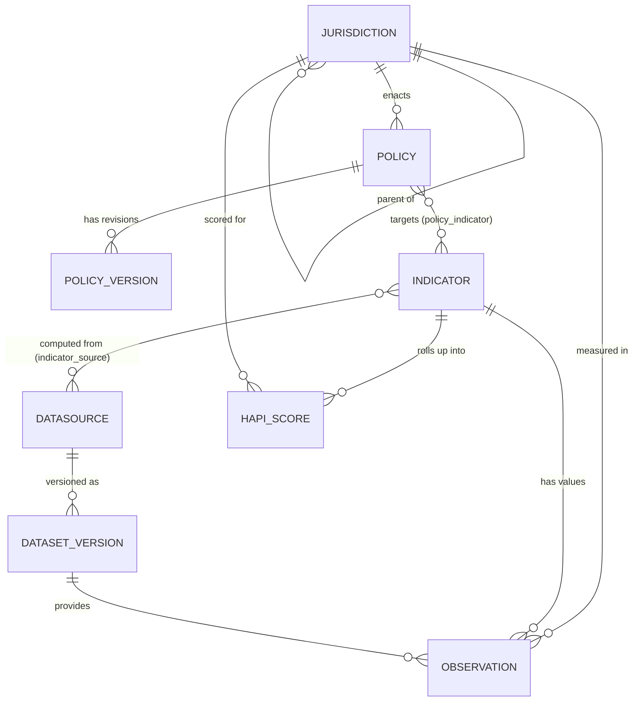

# 03 — Data Model

## 中文概览

本文定义平台的核心数据模型——所有模块的共同地基。五个核心实体:

- **Jurisdiction(管辖区)**:层级树(Canada → Federal / Nova Scotia → …),自引用父子关系,未来无需改 schema 即可加省/市。
- **Policy(政策)**:一条政策记录,含发布时间、部门、全文、AI 摘要、预算、目标人群、KPI、**生命周期状态**(announced→funded→in_effect→amended→retired)。
- **Indicator(指标)**:HAPI 指标的*定义*(域、计算公式、归一化方法、方向、单位),不是取值本身。
- **DataSource(数据源)**:来源元数据(名称、机构、URL、访问方式、许可证、更新频率、抓取时间)——可溯源与可复现的关键。
- **Observation(观测值)**:某指标在某管辖区某时间点的*取值*,并指向其 DataSource。这是事实表。

**两条多对多关系**:政策↔指标(一项政策影响哪些指标)、指标↔数据源(一个指标由哪些源计算)。**版本化**贯穿始终:政策有修订历史,观测值不可变、按抓取批次留存,以保证研究可复现。

---

## 1. Entity-relationship overview



## 2. Core entities

### 2.1 `Jurisdiction`
A self-referential tree of governments. The root is Canada; children are Federal and the provinces/territories; grandchildren (later) can be health authorities or municipalities.

| Field | Type | Notes |
|-------|------|-------|
| `id` | PK | |
| `parent_id` | FK → Jurisdiction | null for the root |
| `name` | text | e.g. "Nova Scotia" |
| `level` | enum | `country` \| `federal` \| `province` \| `region` \| `municipality` |
| `code` | text | e.g. `CA`, `CA-NS` (ISO 3166-2 where applicable) |

> Adding Ontario or BC is a row insert, not a schema change. This is what makes pan-Canadian expansion cheap (see [`01-platform-overview.md`](01-platform-overview.md) §5).

### 2.2 `Policy`
A structured record of one aging-related policy. Free text lives in `full_text`; the AI summary and extracted fields make it queryable.

| Field | Type | Notes |
|-------|------|-------|
| `id` | PK | |
| `jurisdiction_id` | FK → Jurisdiction | who enacted it |
| `title` | text | |
| `department` | text | issuing department/ministry |
| `released_at` | date | publication/announcement date (anchors the timeline) |
| `full_text` | text | full policy text (or extracted body) |
| `source_url` | text | canonical government URL |
| `ai_summary` | text | AI-generated plain-language summary (see docs/04, docs/08) |
| `budget_amount` | numeric | committed budget, if stated |
| `budget_currency` | text | default `CAD` |
| `target_population` | jsonb | e.g. `{ "age": "65+", "group": "dementia" }` |
| `kpis` | jsonb | declared KPIs / targets, if any |
| `lifecycle_status` | enum | `announced` \| `funded` \| `in_effect` \| `amended` \| `retired` |
| `theme` | text[] | e.g. `["home care", "LTC", "dementia"]` |

### 2.3 `PolicyVersion`
Revision history for a policy (amendments, re-announcements, budget changes). Keeps the policy record append-only for reproducibility.

| Field | Type | Notes |
|-------|------|-------|
| `id` | PK | |
| `policy_id` | FK → Policy | |
| `version_no` | int | monotonic |
| `changed_at` | timestamptz | |
| `change_summary` | text | what changed (human or AI) |
| `snapshot` | jsonb | full field snapshot at this version |

### 2.4 `Indicator`
The **definition** of a HAPI indicator — *not* its values. This is where the methodology lives (see [`06-module-indicators-hapi.md`](06-module-indicators-hapi.md)).

| Field | Type | Notes |
|-------|------|-------|
| `id` | PK | |
| `code` | text | stable slug, e.g. `care_access.home_care_hours_per_capita` |
| `domain` | enum | `health` \| `independence` \| `social_participation` \| `financial_security` \| `care_access` \| `digital_inclusion` |
| `name` | text | |
| `definition` | text | precise definition |
| `formula` | text | how it is computed from raw observations |
| `unit` | text | e.g. "hours per 1,000 pop 65+" |
| `normalization` | jsonb | method + parameters (e.g. min-max, z-score, reference range) |
| `direction` | enum | `higher_is_better` \| `lower_is_better` |
| `coverage` | jsonb | jurisdictions + time range covered |

### 2.5 `DataSource`
Metadata for an external source. **The keystone of reproducibility** — every observation must point (via a dataset version) to one of these.

| Field | Type | Notes |
|-------|------|-------|
| `id` | PK | |
| `name` | text | e.g. "Statistics Canada — Table 13-10-…" |
| `publisher` | text | e.g. "Statistics Canada", "CIHI", "NS Open Data" |
| `url` | text | landing/API URL |
| `access_method` | enum | `api` \| `csv` \| `portal_download` \| `web_scrape` |
| `licence` | text | e.g. "Open Government Licence – Canada" |
| `update_frequency` | text | e.g. annual, quarterly |
| `notes` | text | caveats, known gaps |

### 2.6 `DatasetVersion`
A specific retrieval of a `DataSource` at a point in time. Makes ingestion idempotent and makes every number re-fetchable.

| Field | Type | Notes |
|-------|------|-------|
| `id` | PK | |
| `datasource_id` | FK → DataSource | |
| `retrieved_at` | timestamptz | when we fetched it |
| `source_version` | text | publisher's version/edition if available |
| `checksum` | text | hash of the retrieved payload |
| `row_count` | int | sanity/quality check |

### 2.7 `Observation`
A single measured value: indicator × jurisdiction × time. This is the central fact table that powers HAPI and analytics. **Immutable** — corrections create new rows under a new dataset version.

| Field | Type | Notes |
|-------|------|-------|
| `id` | PK | |
| `indicator_id` | FK → Indicator | |
| `jurisdiction_id` | FK → Jurisdiction | |
| `dataset_version_id` | FK → DatasetVersion | provenance |
| `period` | daterange / date | the time the value refers to |
| `value` | numeric | the raw measured value |
| `value_normalized` | numeric | post-normalization (per indicator method) |
| `quality_flag` | enum | `ok` \| `estimated` \| `suppressed` \| `provisional` |

### 2.8 `HapiScore`
A rolled-up score for a jurisdiction (overall or per-domain) at a point in time, derived from normalized observations.

| Field | Type | Notes |
|-------|------|-------|
| `id` | PK | |
| `jurisdiction_id` | FK → Jurisdiction | |
| `domain` | enum / `overall` | which HAPI domain (or composite) |
| `period` | date | |
| `score` | numeric | 0–100 (see docs/06 for scaling) |
| `method_version` | text | which HAPI methodology version produced it |
| `inputs` | jsonb | indicator codes + weights used (auditability) |

## 3. Relationship (join) tables

| Table | Connects | Meaning |
|-------|----------|---------|
| `policy_indicator` | Policy ↔ Indicator | which indicators a policy is intended to move (many-to-many) |
| `indicator_source` | Indicator ↔ DataSource | which sources an indicator is computed from (many-to-many) |

`policy_indicator` is what makes [`07-module-policy-analytics.md`](07-module-policy-analytics.md) possible: it links a policy event to the outcome indicators it claims to affect, so the analytics layer knows *what to test*.

## 4. Versioning & reproducibility (why the model looks like this)

Three deliberate choices make the platform a *research instrument* rather than a dashboard:

1. **Observations are immutable and provenance-bound.** Every value links to a `DatasetVersion` → `DataSource`. Re-running an analysis months later yields the same numbers, or shows exactly what changed.
2. **Policies are append-only.** `PolicyVersion` preserves amendment history, so "the policy as it stood in 2019" is recoverable.
3. **Methodology is versioned.** `Indicator.normalization` and `HapiScore.method_version` record *how* a score was produced, so HAPI can evolve without silently invalidating past results.

This is the database expression of Design Principle 1 (reproducibility first) from [`00-vision.md`](00-vision.md).

## 5. Worked example (NS home care)

```
Jurisdiction: Nova Scotia (CA-NS)
Policy: "Action for Health: Home Care Expansion" (released_at 2022-04, budget 65,000,000 CAD,
        target_population {age: 65+}, lifecycle in_effect, theme [home care])
   └─ policy_indicator → Indicator care_access.home_care_hours_per_capita
                       → Indicator health.avoidable_ed_visits_65plus
Indicator care_access.home_care_hours_per_capita
   └─ indicator_source → DataSource "CIHI Home Care Reporting System"
   └─ Observations: (NS, 2018..2024) values from DatasetVersion(retrieved 2026-…, checksum …)
HapiScore: (NS, domain=care_access, 2023, score=…, method_version v1, inputs {weights…})
```

This single example threads every entity together and is the canonical seed scenario for the implementation phase (see [`11-implementation-roadmap.md`](11-implementation-roadmap.md)).
