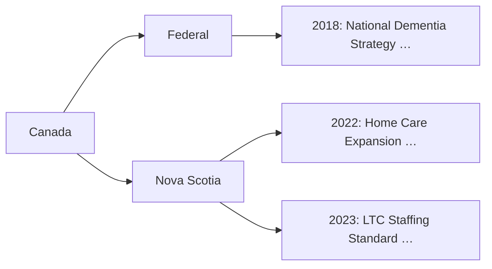
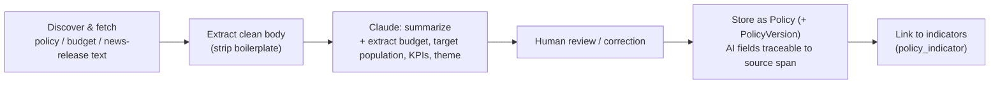
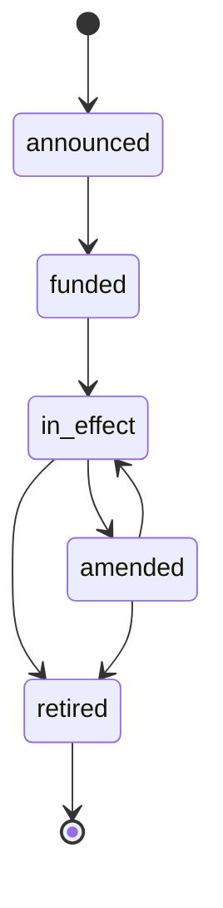

# 04 — Module ① Policy Library

## 中文概览

政策库是平台的**定性主干**:用统一结构记录"谁、在何时、用多少钱、为了哪些人、做了什么决定",并跟踪每条政策的**生命周期**。

- **组织方式**:管辖区树 + 时间轴(Canada → Federal / Nova Scotia → 年份 → 政策)。
- **每条政策记录的字段**:发布时间、发布部门、政策全文、AI 摘要、预算、目标人群、KPI、生命周期状态、主题标签。
- **AI 自动整理**:抓取原文 → Claude 生成摘要、抽取预算/目标人群/KPI/主题 → 人工复核 → 入库。所有 AI 字段可溯源到原文。
- **生命周期**:announced → funded → in_effect → amended → retired,用 `PolicyVersion` 留存修订史。

---

## 1. Purpose

The Policy Library is the structured, longitudinal record of aging-related policy. Where the Data Hub holds *numbers*, the Policy Library holds *decisions* — and makes them queryable, comparable across jurisdictions, and trackable over their whole lifecycle.

It is the module that lets us later ask, in [`07-module-policy-analytics.md`](07-module-policy-analytics.md): *"This policy was announced in 2022 and claimed to target home-care access — did the relevant indicators move?"*

## 2. Organization: jurisdiction tree × time axis

```
Canada
├── Federal
│   ├── 2000
│   ├── 2001
│   └── …
└── Nova Scotia
    ├── 2000
    ├── 2001
    └── …
```

Every policy hangs off a `Jurisdiction` node and is anchored in time by `released_at`. The UI renders this two ways:

- a **timeline** view (horizontal, per jurisdiction, with lifecycle bands), and
- a **jurisdiction tree** browser (drill from Canada → province → year → policy).



## 3. The policy record

Each record carries the fields defined in [`03-data-model.md`](03-data-model.md) §2.2. Summarized:

| Field | Example |
|-------|---------|
| Release date | 2022-04-12 |
| Department | NS Dept. of Seniors and Long-term Care |
| Full text | (ingested policy/budget/news-release text) |
| AI summary | 2–4 sentence plain-language summary |
| Budget | 65,000,000 CAD |
| Target population | `{ age: "65+", group: "home care recipients" }` |
| KPIs | declared targets (e.g. "+X home-care hours by 2025") |
| Lifecycle | `in_effect` |
| Theme tags | `["home care", "LTC"]` |

## 4. AI-assisted curation pipeline

Manually structuring hundreds of policies is the bottleneck. The library uses AI to do the first pass, with human review before anything is trusted.



Principles (consistent with [`08-module-ai-research-assistant.md`](08-module-ai-research-assistant.md)):

- **Every AI-extracted field is traceable** to the source text span it came from.
- **AI proposes, human disposes.** Extracted budgets/KPIs are flagged "AI-extracted, unverified" until reviewed.
- **Re-summarization is versioned.** Re-running the model creates a new `PolicyVersion`, never a silent overwrite.

## 5. Lifecycle tracking

A policy is not a static document; it moves through states. The library models this explicitly so the timeline reflects reality and so analytics can use the *right* date (announcement vs. coming-into-effect can differ by years).



Each transition is captured as a `PolicyVersion` with a `change_summary`, so the amendment history is fully reconstructable.

## 6. Linking policies to outcomes

The `policy_indicator` join (see [`03-data-model.md`](03-data-model.md) §3) records which HAPI indicators a policy is *intended* to move. This is what turns the library from an archive into an analyzable object: it tells the analytics layer which outcomes to test against which policy events.

## 7. v1 scope

- Seed a meaningful set of **Nova Scotia + Federal** aging policies (home care, LTC, dementia, seniors' financial supports).
- Full jurisdiction-tree + timeline browsing.
- AI summaries + extracted fields with human review.
- Lifecycle status on every record.

Out of v1: automated continuous policy *discovery* (crawling). v1 curates a high-quality seed set; automated discovery is a later enhancement (see [`11-implementation-roadmap.md`](11-implementation-roadmap.md)).
