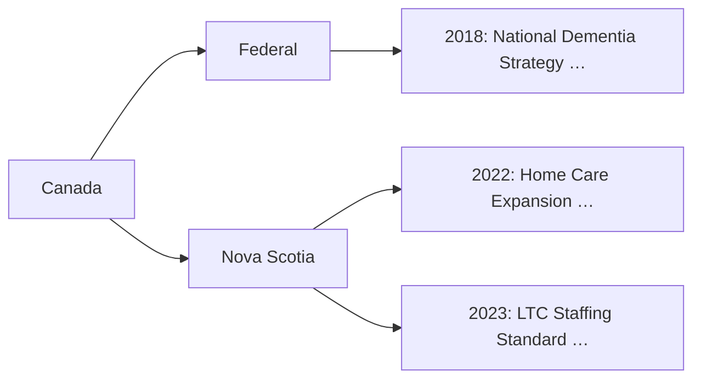
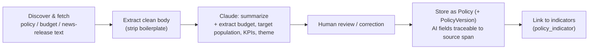
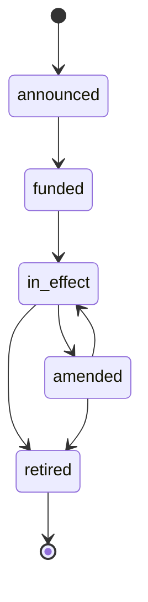
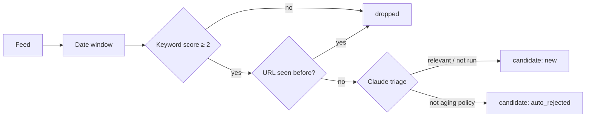

# 04 — Module ① Policy Library

## 中文概览

政策库是平台的**定性主干**:用统一结构记录"谁、在何时、用多少钱、为了哪些人、做了什么决定",并跟踪每条政策的**生命周期**。

- **组织方式**:管辖区树 + 时间轴(Canada → Federal / Nova Scotia → 年份 → 政策)。
- **每条政策记录的字段**:发布时间、发布部门、政策全文、AI 摘要、预算、目标人群、KPI、生命周期状态、主题标签。
- **AI 自动整理**:抓取原文 → Claude 生成摘要、抽取预算/目标人群/KPI/主题 → 人工复核 → 入库。所有 AI 字段可溯源到原文。
- **生命周期**:announced → funded → in_effect → amended → retired,用 `PolicyVersion` 留存修订史。
- **Policy Watch(持续跟进)**:每天轮询联邦新闻 API、Canada Gazette I/II、NS 新闻稿 → 关键词 + Claude 两级筛选 → 候选队列 → 每周 GitHub Issue 摘要 → 人工接受后起草进种子文件并开 PR(见 §9)。

---

## 1. Purpose

The Policy Library is the structured, longitudinal record of aging-related policy. Where the Data Hub holds *numbers*, the Policy Library holds *decisions* — and makes them queryable, comparable across jurisdictions, and trackable over their whole lifecycle.

It is the module that lets us later ask, in [`07-module-policy-analytics.md`](07-module-policy-analytics.md): *"This policy was announced in 2022 and claimed to target home-care access — did the relevant indicators move?"*

## 2. Organization: jurisdiction tree × time axis

```
Canada
├── Federal
│   ├── 2000
│   ├── 2001
│   └── …
└── Nova Scotia
    ├── 2000
    ├── 2001
    └── …
```

Every policy hangs off a `Jurisdiction` node and is anchored in time by `released_at`. The UI renders this two ways:

- a **timeline** view (horizontal, per jurisdiction, with lifecycle bands), and
- a **jurisdiction tree** browser (drill from Canada → province → year → policy).


```mermaid
flowchart LR
    CA["Canada"] --> FED["Federal"]
    CA --> NS["Nova Scotia"]
    FED --> F1["2018: National Dementia Strategy …"]
    NS --> N1["2022: Home Care Expansion …"]
    NS --> N2["2023: LTC Staffing Standard …"]
```

## 3. The policy record

Each record carries the fields defined in [`03-data-model.md`](03-data-model.md) §2.2. Summarized:

| Field | Example |
|-------|---------|
| Release date | 2022-04-12 |
| Department | NS Dept. of Seniors and Long-term Care |
| Full text | (ingested policy/budget/news-release text) |
| AI summary | 2–4 sentence plain-language summary |
| Budget | 65,000,000 CAD |
| Target population | `{ age: "65+", group: "home care recipients" }` |
| KPIs | declared targets (e.g. "+X home-care hours by 2025") |
| Lifecycle | `in_effect` |
| Theme tags | `["home care", "LTC"]` |

## 4. AI-assisted curation pipeline

Manually structuring hundreds of policies is the bottleneck. The library uses AI to do the first pass, with human review before anything is trusted.


```mermaid
flowchart LR
    A["Discover & fetch<br/>policy / budget / news-release text"] --> B["Extract clean body<br/>(strip boilerplate)"]
    B --> C["Claude: summarize<br/>+ extract budget, target population, KPIs, theme"]
    C --> D["Human review / correction"]
    D --> E["Store as Policy (+ PolicyVersion)<br/>AI fields traceable to source span"]
    E --> F["Link to indicators<br/>(policy_indicator)"]
```

Principles (consistent with [`08-module-ai-research-assistant.md`](08-module-ai-research-assistant.md)):

- **Every AI-extracted field is traceable** to the source text span it came from.
- **AI proposes, human disposes.** Extracted budgets/KPIs are flagged "AI-extracted, unverified" until reviewed.
- **Re-summarization is versioned.** Re-running the model creates a new `PolicyVersion`, never a silent overwrite.

## 5. Lifecycle tracking

A policy is not a static document; it moves through states. The library models this explicitly so the timeline reflects reality and so analytics can use the *right* date (announcement vs. coming-into-effect can differ by years).


```mermaid
stateDiagram-v2
    [*] --> announced
    announced --> funded
    funded --> in_effect
    in_effect --> amended
    amended --> in_effect
    in_effect --> retired
    amended --> retired
    retired --> [*]
```

Each transition is captured as a `PolicyVersion` with a `change_summary`, so the amendment history is fully reconstructable.

## 6. Linking policies to outcomes

The `policy_indicator` join (see [`03-data-model.md`](03-data-model.md) §3) records which HAPI indicators a policy is *intended* to move. This is what turns the library from an archive into an analyzable object: it tells the analytics layer which outcomes to test against which policy events.

## 7. v1 scope

- Seed a meaningful set of **Nova Scotia + Federal** aging policies (home care, LTC, dementia, seniors' financial supports).
- Full jurisdiction-tree + timeline browsing.
- AI summaries + extracted fields with human review.
- Lifecycle status on every record.

v1 curated a high-quality seed set by hand. Continuous discovery of *new* policy is now handled by **Policy Watch** (§9), which proposes candidates; a person still decides what enters the library.

## 8. Visualization (web)

The `/policies` page renders a **timeline strip** (`PolicyTimeline`): every
catalogued policy as a dot on a shared year axis, coloured by jurisdiction, with
dots stacked within a year. Hovering previews the title; **clicking a dot pins a
detail card** with an explicit *open source ↗* link; the legend filters a
jurisdiction. The same strip appears on the homepage ("Aging-policy cadence").
See RUNBOOK §F for the component inventory and interaction details.

## 9. Policy Watch — continuous discovery

The seed tells us what policy *existed*; Policy Watch tells us what is *new*.
It turns the library from a one-off curation into a monitored system.

**Sources** (`pipeline/hapi_pipeline/watch/sources.py`) — official,
machine-readable feeds, chosen by where a policy first becomes public:

| Source | Stage it catches | Format |
|---|---|---|
| Government of Canada news API (`api.io.canada.ca`), all departments + ESDC / PHAC backstops | announcements, funding | Atom |
| Canada Gazette Part I | proposed regulations, notices | RSS |
| Canada Gazette Part II | enacted regulations | RSS |
| Nova Scotia news releases (`news.novascotia.ca` listing + each release page) | provincial announcements, funding | HTML |

Every source was verified live with `hapi watch probe` from a GitHub runner.
That check changed the design twice. The Gazette feed lists whole *issues*, so
each issue's table of contents is expanded into one item per notice or
regulation. Nova Scotia has no working feed: the legacy RSS returns an empty
stub, the open-data copy of its releases (`xcif-vvr3`) stopped updating in July
2026, and the new news site advertises none. Its release URLs carry their date
(`/en/YYYY/MM/DD/slug`), so the listing page is read directly and each release
page's description fetched.

Adding a source means adding one `WatchSource` entry and a fixture.

**Pipeline** (`hapi watch fetch`), one source at a time:


```mermaid
flowchart LR
  F[Feed] --> W[Date window] --> K{Keyword score ≥ 2}
  K -- no --> X[dropped]
  K -- yes --> D{URL seen before?}
  D -- yes --> X
  D -- no --> C{Claude triage}
  C -- relevant / not run --> N[candidate: new]
  C -- not aging policy --> R[candidate: auto_rejected]
```

1. **Keywords** (free, deterministic). Weighted terms over title + summary +
   department. Strong terms — *seniors, older adults, long-term care, home care,
   dementia, OAS/GIS, CPP, New Horizons, age-friendly…* — pass alone; weak terms
   — *pension, retirement, disability, caregivers, bare "aging"* — need company,
   which keeps public-service pensions, aging infrastructure and child-care news out.
2. **Dedup** on a hash of the normalized URL (tracking params and fragments
   stripped), so re-polling is idempotent and Claude is never paid twice for an item.
3. **Claude triage** (optional, `ANTHROPIC_API_KEY`). A structured-output call
   decides whether the item is a government policy action whose main subject
   is older adults, gives a category (*new_policy, amendment, funding,
   regulation, consultation, report, other*) with a one-line rationale, and
   drafts library fields (lifecycle, theme, target group, budget, HAPI
   domains). Items judged irrelevant are kept as `auto_rejected` and still
   listed (collapsed) in the digest, so false negatives can be caught.

**Review — a person decides.** Candidates live in `policy_candidate`
(`db/migrations/0009`). A weekly GitHub issue lists them; the *Policy Watch
review* workflow (or `hapi watch review --accept … --reject …`) records the
decision. Accepting drafts an entry in `seed_policies.json` and opens a PR, where
the reviewer replaces the feed teaser with a proper `full_text` and links
indicators before merging; the next ingest loads it. The library therefore
remains a curated, version-controlled seed — every record has a reviewed diff.

**Limits.** Feeds report announcements, not implementation: a funded program
can lapse without a release. Coverage is what the feeds carry — Nova Scotia
legislation and the NS Royal Gazette, federal bills (LEGISinfo), budgets and
FPT Seniors Forum communiqués are not yet watched. Keyword triage favours
recall; Claude's verdict is advisory, never final.
