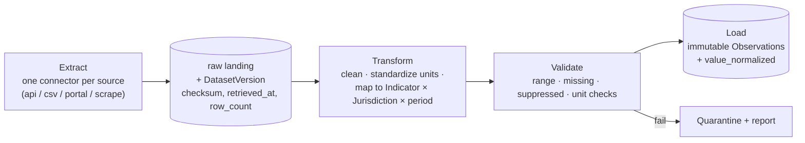
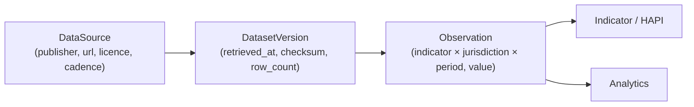

# 05 — Module ② Data Hub

## 中文概览

数据中心是平台**最重要**的部分:所有下游的可信度都继承自它。它把分散的公开数据,变成**干净、版本化、可溯源、可复现**的观测值(Observations)。

- **数据源**:Canada Open Data、Statistics Canada、Health Infobase、Nova Scotia Open Data / NS Health、CIHI、人口普查(详见 [`10-data-sources-catalog.md`](10-data-sources-catalog.md))。
- **ETL 管道(Python)**:采集(每源一个连接器)→ 清洗/标准化 → 映射到 `Indicator` × `Jurisdiction` × `period` → 质量校验 → 入库为不可变 Observation,并记录 `DatasetVersion`(抓取时间、校验和、行数)。
- **数据血缘/版本化**:每个数值都能回溯到具体来源与抓取批次;修正不覆盖旧值,而是新增版本。
- **质量校验**:行数、范围、缺失值、被抑制值(suppressed)、单位一致性等检查。

---

## 1. Why this is the most important module

Everything downstream — HAPI scores, analytics, AI answers — is only as trustworthy as the data beneath it. The Data Hub's job is to make that data **clean, versioned, traceable, and reproducible**. If a reviewer asks "where did this number come from and can I reproduce it?", the Data Hub must answer without ambiguity.

## 2. Sources (v1: Nova Scotia + Federal)

| Source | Role | Detail |
|--------|------|--------|
| **Statistics Canada** | Demographics, health, income, social outcomes | Tables via API/CSV |
| **Health Infobase (PHAC)** | Health-of-people indicators, chronic disease | Dashboards + downloads |
| **CIHI** | Health-system use: home care, LTC, ED visits, hospitalization | Reports + datasets |
| **Canada Open Data** | Federal departmental datasets | Open Government portal |
| **Nova Scotia Open Data / NS Health** | Provincial datasets | NS portals |
| **Census of Population** | Population structure, aging | StatCan census |

Concrete URLs, access methods, licences, and cadences are cataloged in [`10-data-sources-catalog.md`](10-data-sources-catalog.md). Each becomes a `DataSource` row (see [`03-data-model.md`](03-data-model.md) §2.5).

## 3. ETL pipeline (Python)

- **Extract** — one connector per source under `pipeline/ingest/`. Each fetch creates a `DatasetVersion` row capturing `retrieved_at`, `source_version`, `checksum`, and `row_count`. Re-running with unchanged upstream data is a no-op (idempotent).
- **Transform** — clean, harmonize units, and map each record to the canonical `(indicator, jurisdiction, period)` key. Normalization per indicator method (see [`06-module-indicators-hapi.md`](06-module-indicators-hapi.md)).
- **Validate** — quality checks before load; failures are quarantined and reported, not silently dropped.
- **Load** — write **immutable** `Observation` rows bound to their `DatasetVersion`.

## 4. Data lineage & versioning

- **Forward traceability:** from a HAPI score or a chart, drill back to the exact observations, dataset version, and source.
- **Correction policy:** upstream revisions create a *new* `DatasetVersion` and *new* observations; old values are retained. Nothing is overwritten — this is what guarantees a re-run reproduces past results or shows precisely what changed.

## 5. Data quality checks

| Check | Example |
|-------|---------|
| Row count / completeness | retrieved table has expected number of rows |
| Range | rates within plausible bounds; no negatives where impossible |
| Missing / suppressed | StatCan/CIHI suppression flags mapped to `quality_flag = suppressed` |
| Unit consistency | per-capita vs. counts harmonized to indicator unit |
| Temporal continuity | gaps in a time series flagged |
| Cross-source sanity | overlapping measures from two sources broadly agree |

Failed checks set `quality_flag` (`estimated` / `suppressed` / `provisional`) or quarantine the batch.

## 6. Refresh & scheduling

Each `DataSource` declares an `update_frequency`. The pipeline runs as scheduled idempotent jobs (worker/cron). A refresh that finds no upstream change makes no new observations; a changed source produces a new `DatasetVersion`, keeping the history intact.

## 7. v1 scope

- Connectors for a first set of sources covering the seed indicators (especially **care access**: home care, LTC, ED visits — directly tied to the author's LTC work).
- Full lineage (`DataSource` → `DatasetVersion` → `Observation`) on every value.
- Quality checks + quarantine.

Out of v1: a large connector zoo for every source at once. v1 proves the lineage/versioning pattern on a focused set; new sources are additive (one connector each).

## 8. Visualization & lineage display (web)

The `/data` page lists every indicator with a per-jurisdiction `TrendChart` and an
expandable **Data & lineage** table. Because the observation store is append-only,
a period may carry several `dataset_version`s (a fixture and a live load, or
successive live runs); the table **dedupes to the authoritative version** — live
over fixture, then newest version — so identical rows never repeat, while the full
version history stays queryable in the store. A **Source** column shows a
`live`/`fixture` tag + the dataset checksum (datasource + `source_version` on
hover), and the `fixture` tag links to a "Why fixture?" note (CIHI has no open
API — §6). See RUNBOOK §F.
