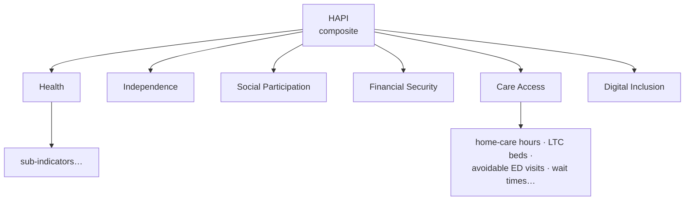
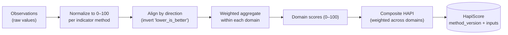
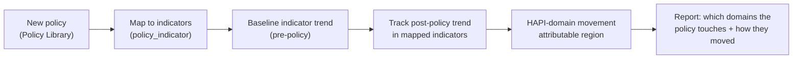

# 06 — Module ③ Indicators: the Healthy Aging Policy Index (HAPI)

## 中文概览

这是作者最期待的模块。核心主张:**不直接照搬政府指标,而是自建一个透明、可复现的独立指数——Healthy Aging Policy Index(HAPI)**。

- **六个一级域**:Health(健康)、Independence(独立性)、Social Participation(社会参与)、Financial Security(经济保障)、Care Access(照护可及性)、Digital Inclusion(数字包容)。
- **每个子指标必须标注**:定义、计算公式、数据源、归一化方法、方向(越高越好/越低越好)、覆盖的管辖区与时间范围。
- **评分方法学**:原始值 → 归一化(0–100)→ 按方向对齐 → 域内加权汇总 → 域得分 → 综合 HAPI。方法版本化(`method_version`),权重与输入可审计。
- **政策自动评分**:政府出台新政 → 映射到相关指标 → 系统按指标变化自动给出该政策领域的 HAPI 影响评估。**这本身就是论文**(指数设计 + 评估框架)。
- **严谨声明**:HAPI 衡量的是*结果状态与趋势*,把某项政策的"功劳"归因到指标变化需要 [`07`](07-module-policy-analytics.md) 的因果设计,不能仅凭评分下因果结论。

---

## 1. The core idea

Governments publish metrics that suit governments. To evaluate policy *independently*, the observatory maintains its own index: the **Healthy Aging Policy Index (HAPI)** — a transparent, documented, reproducible composite that scores how well a jurisdiction supports healthy aging, and how that changes over time.

HAPI is not a single number pulled from a report. It is a **methodology**: defined indicators, sourced data, explicit normalization, and versioned scoring. That methodology *is* a publishable research contribution (Paper 1; see [`09-research-roadmap.md`](09-research-roadmap.md)).

## 2. The six domains

| Domain | What it captures | Illustrative sub-indicators |
|--------|------------------|------------------------------|
| **Health** | Health status of older adults | Healthy life expectancy at 65; chronic-disease prevalence; avoidable ED visits (65+); self-rated health |
| **Independence** | Ability to live independently | Activities-of-daily-living limitation rate; aging-in-place rate; functional disability |
| **Social Participation** | Engagement & connection | Volunteer/community participation; social isolation/loneliness; transport access |
| **Financial Security** | Economic stability in old age | Low-income rate (65+); pension/GIS coverage; out-of-pocket health spend |
| **Care Access** | Access to needed care | Home-care hours per capita; LTC beds & wait times; home-care wait times; unmet care needs |
| **Digital Inclusion** | Access to the digital world | Internet access (65+); digital-service use; digital-literacy support |

> **Care Access** is prioritized in v1 because it maps most directly to the author's long-term-care work and to high-signal CIHI data.

Each sub-indicator is an `Indicator` row (see [`03-data-model.md`](03-data-model.md) §2.4) and **must** declare: definition, formula, data source(s), normalization method, direction, and coverage. No indicator enters HAPI without all six.

## 3. Scoring methodology

1. **Normalize.** Each raw value → 0–100 via the indicator's declared method (e.g. min-max against a reference range, or z-score rescaled). Parameters stored in `Indicator.normalization`.
2. **Align direction.** "Lower is better" indicators (e.g. avoidable ED visits) are inverted so higher always means healthier-aging.
3. **Aggregate within domain.** Weighted mean of an domain's normalized indicators → domain score.
4. **Composite.** Weighted mean across domains → overall HAPI, using **theory-anchored "expert" tiers** (Tier 1: Health, Care Access; Tier 2: Financial Security, Independence; Tier 3: Social Participation, Digital Inclusion — grounded in the WHO healthy-ageing and HelpAge AgeWatch frameworks), renormalized over the domains present for a jurisdiction × year. The choice is **sensitivity-tested**: `hapi weights` reports the composite under *equal*, *expert*, and *empirical* (coefficient-of-variation) schemes side by side, per the OECD/JRC Handbook on Constructing Composite Indicators. Documented in [`weighting.py`](../pipeline/hapi_pipeline/indicators/weighting.py); adjustable in a future method version.
5. **Persist with provenance.** Each `HapiScore` records `method_version` and the `inputs` (indicator codes + weights), so any score is fully auditable and reproducible (see [`03-data-model.md`](03-data-model.md) §2.8).

**Versioned methodology.** Weights and normalization can evolve; `method_version` ensures past scores remain interpretable and past papers remain reproducible.

## 4. Automatic policy scoring

The payoff: when a government announces a new policy, the system can position it against the index automatically.

This produces, for any policy, a structured view of *which HAPI domains it targets* and *how those indicators have moved* since it took effect.

## 5. Rigor: what HAPI does and does not claim

- **HAPI measures outcome *states and trends*** for a jurisdiction over time. That is a descriptive, reproducible measurement.
- **HAPI does not, by itself, prove a policy *caused* a change.** Attributing indicator movement to a specific policy requires the quasi-experimental designs in [`07-module-policy-analytics.md`](07-module-policy-analytics.md) (interrupted time series, difference-in-differences, synthetic control), each with stated assumptions.
- The automatic-scoring view above is explicitly framed as **"policy targets these domains; here is how they moved"** — an evidence-gathering step, *not* a causal verdict.

Holding this line is what makes HAPI academically credible rather than a vanity score.

## 6. v1 scope

- Define the six domains and a **first, defensible set of sub-indicators**, weighted toward Care Access and Health.
- Full indicator definitions (all six required attributes) for the v1 set.
- Working normalization + scoring producing NS + Federal HAPI domain scores over time.
- Documented `method_version` v1.

Out of v1: an exhaustive indicator set for all six domains. v1 establishes the *method* on a focused indicator set; breadth is added incrementally without changing the model.

## 7. Visualization (web)

`/hapi` (and the homepage) render a **domain-profile radar**
(`DomainRadarOverTime`): one polygon per jurisdiction across the scored domains,
0–100. A **year slider + ▶ play** scrubs the profile over time using
last-observation-carried-forward, so it fills in smoothly as each domain's
indicators come online rather than blinking on irregular cadences. Per-domain
`TrendChart`s sit below, optionally overlaid with **policy-event markers** for the
policies targeting that domain. Every score stays auditable to its raw inputs in
an expandable table. See RUNBOOK §F.
