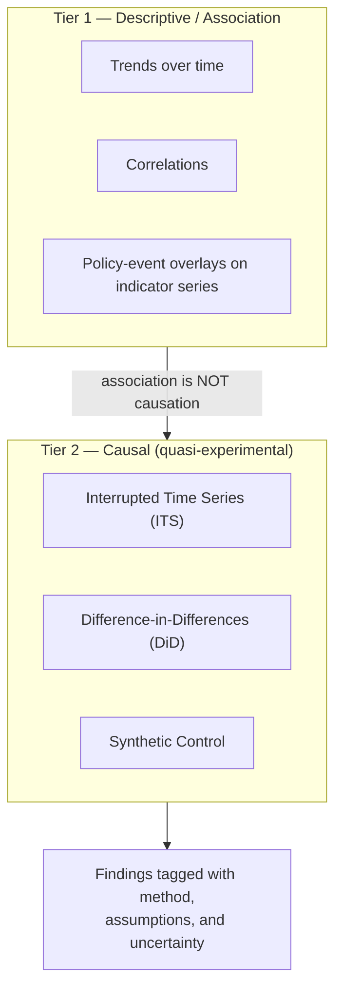
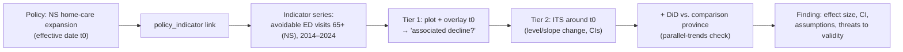

# 07 — Module ④ Policy Analytics

## 中文概览

本模块回答"政策有没有用"的问题——但以**严谨**的方式回答。这是平台学术可信度的核心,措辞必须谨慎,避免过度宣称。

- **典型问题**:Nova Scotia 近十年 Home Care 投资增加了吗?LTC 投资增加后,急诊就诊(ED visits)是否下降?住院是否下降?生活满意度是否提高?
- **两个层次**:
  - **描述性关联(Descriptive / association)**:展示趋势、相关性、政策时点叠加——快速、直观,但**关联≠因果**。
  - **因果推断(Causal)**:采用准实验设计——中断时间序列(ITS)、差分(DiD)、合成控制(Synthetic Control)——每种都有明确前提与局限。
- **核心声明(贯穿全平台)**:默认只做关联;任何因果措辞都必须挂靠一个具名设计、写明假设、给出不确定性。系统在 UI 与导出中**显式标注**某个结论是"关联"还是"因果(在某设计下)"。

---

## 1. What this module is for

Policy Analytics connects the Policy Library (decisions) and the Indicators/HAPI layer (outcomes) to ask whether policies are associated with — and, under stronger designs, plausibly caused — changes in outcomes.

Example questions it is built to support:

- *Has Nova Scotia's home-care investment risen over the past decade?* (descriptive)
- *After LTC/home-care investment increased, did avoidable ED visits fall? Did hospitalizations fall? Did life satisfaction rise?* (association → potentially causal)

## 2. Two clearly separated tiers

**Tier 1 — Descriptive / association.** Fast, intuitive: plot an indicator over time, overlay policy events, compute correlations. Useful for exploration and hypothesis generation. **It cannot establish causation** and is always labeled as association.

**Tier 2 — Causal (quasi-experimental).** When the question is "did the policy *work*", a named design is required:

| Design | Idea | Key assumptions / limits |
|--------|------|--------------------------|
| **Interrupted Time Series (ITS)** | Model the outcome trend before vs. after a policy's effective date | Needs enough pre/post points; no other coincident shocks; correct functional form; autocorrelation handled |
| **Difference-in-Differences (DiD)** | Compare a jurisdiction that adopted a policy to one that did not, before vs. after | **Parallel-trends** assumption; comparable units; no contemporaneous confounders differing across groups |
| **Synthetic Control** | Build a weighted "synthetic" comparison jurisdiction from others | Good donor pool; pre-period fit; one treated unit; no spillover |

Each design's assumptions are surfaced *with the result*, not buried.

## 3. The "association ≠ causation" guardrail (platform-wide)

This is the single most important discipline in the platform:

1. **Default to association.** Any analysis is descriptive unless it is run under a named Tier-2 design.
2. **Causal language requires a design.** A finding may use causal wording only if it (a) names its design, (b) states its assumptions, and (c) reports uncertainty.
3. **Explicit labeling in UI and exports.** Every result card is tagged **`Association`** or **`Causal (ITS/DiD/SC)`** so a reader can never mistake one for the other.
4. **Confounders are named.** Coincident events (pandemic, federal transfers, demographic shifts) are listed as threats to validity.

This guardrail is why HAPI's automatic policy scoring ([`06-module-indicators-hapi.md`](06-module-indicators-hapi.md) §4) is framed as "the policy targets these domains; here is how they moved" — an *association/evidence* statement, upgraded to causal only through this module.

## 4. Worked pattern: home-care investment → avoidable ED visits

The `policy_indicator` join ([`03-data-model.md`](03-data-model.md) §3) tells the module *which* indicators a policy claims to target, so the right outcome series are tested — not cherry-picked.

## 5. Reproducibility

- Analyses run in Python (`pipeline/analytics/`, e.g. statsmodels) over **immutable, versioned observations**, so any result re-runs to the same numbers (see [`05-module-data-hub.md`](05-module-data-hub.md)).
- Each finding stores its inputs (indicator codes, jurisdictions, date windows), method, and parameters — making it auditable and citable.

## 6. Relationship to the AI assistant

The AI Research Assistant ([`08-module-ai-research-assistant.md`](08-module-ai-research-assistant.md)) can *propose* analyses and *narrate* results, but the statistics are computed by this module's code, and the assistant must report the same `Association` / `Causal` tag. The AI never silently upgrades an association to a causal claim.

## 7. v1 scope

- Tier-1 descriptive analytics (trends, overlays, correlations) over the seed indicators.
- At least one fully worked **ITS** example (e.g. NS home-care policy → care-access/health indicator) demonstrating the Tier-2 pattern, with assumptions and limitations written out.
- The `Association` / `Causal` tagging convention implemented end-to-end.

Out of v1: a large library of causal studies. v1 establishes the *framework and guardrails*; individual rigorous studies are the substance of Paper 4 (see [`09-research-roadmap.md`](09-research-roadmap.md)).

## 8. Visualization (web)

`/analytics` renders each finding as a card tagged **Association** or
**Causal (ITS)**.

- **Trend (association)** cards show a `TrendChart` overlaid with **policy-event
  markers** — a violet dashed vertical for every policy targeting the indicator,
  positioned by interpolating the policy's date against the series — so policy
  timing can be read against the outcome trend. There is **one card per
  (indicator, jurisdiction)**: findings are derived state, recomputed each run
  (`DELETE` + rebuild in `run_analyses`), so retired indicators and per-policy
  duplicates never linger (RUNBOOK §F).
- **ITS (causal)** cards show an `ItsChart` segmented-regression picture: the
  observed series, the intervention marker, the fitted pre/post segments, and the
  dashed **counterfactual** (pre-trend projected forward) — the gap between the
  post-segment and the counterfactual is the estimated effect. The coefficient
  table carries pre-trend / level-change / slope-change with 95% CIs, p-values,
  n_pre/post and R².

The same `association ≠ causation` guardrail (§3) governs every label, and
titles use the indicator's human name + jurisdiction (RUNBOOK §F).
