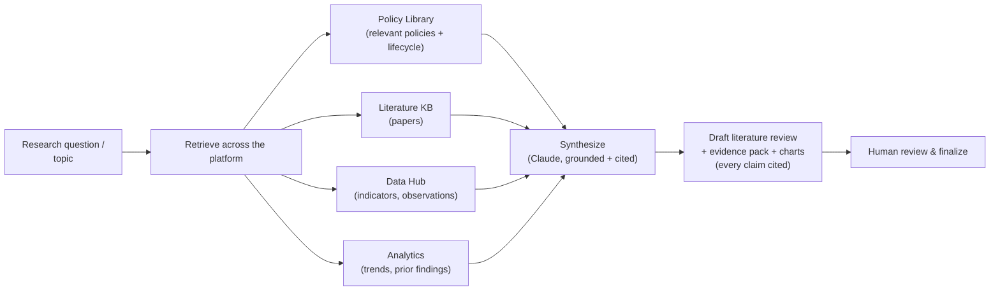
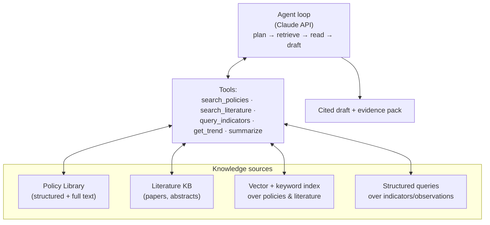

# 08 — Module ⑤ AI Research Assistant

## 中文概览

这是平台面向研究者的"放大器"。目标:把"我想研究 Nova Scotia dementia policy"这样一句话,变成一份**有出处、可溯源**的研究起点。

- **能力**:输入一个研究主题,AI 自动 —— 找政策(Policy Library)、找论文(文献库)、找数据(Data Hub)、找统计图、找趋势,最后生成一份**带引用的 Literature Review** 草稿。
- **技术路线**:在平台自有语料(政策库 + 指标 + 数据)与外部学术文献之上做**检索增强生成(RAG)** + **Agent 工作流**,由 Claude API 编排。
- **铁律(可溯源)**:每一条陈述都必须挂引用,指向政策记录、观测值或文献条目;不杜撰来源;区分"关联/因果"标签(沿用 [`07`](07-module-policy-analytics.md));AI 产出永远是**草稿 + 证据**,由人定稿。

---

## 1. Purpose

The AI Research Assistant turns a research intent into a sourced starting point. The motivating interaction:

> **Input:** "I want to study Nova Scotia dementia policy."
>
> **The assistant automatically:** finds relevant policies → finds papers → finds data → finds charts → finds trends → **drafts a cited literature review.**

It is the module that makes the whole platform feel like a research accelerator rather than a database.

## 2. What it does

Outputs are an **evidence pack** (the retrieved policies, observations, papers, and charts) plus a **draft literature review** in which every statement is linked to an item in that pack.

## 3. Architecture: RAG + agentic workflow

- **Retrieval** combines vector search (semantic) and keyword/structured queries over the Policy Library, the literature knowledge base, and the indicator/observation tables.
- **Agentic loop** (Claude API): plan the sub-questions, call retrieval tools, read results, and synthesize — iterating until the topic is covered.
- **Tools** are thin wrappers over the same data the rest of the platform uses, so the assistant and the dashboards always agree.

## 4. Grounding & traceability (the non-negotiables)

Consistent with the platform's reproducibility and honest-inference principles ([`00-vision.md`](00-vision.md) §5):

1. **Every claim is cited.** Each sentence in a generated review links to a specific policy record, observation, or literature item. Uncited assertions are treated as defects.
2. **No fabricated sources.** The assistant may only cite items that exist in the platform's stores; it cannot invent references.
3. **Carries the Association/Causal tag.** When it reports an analytic result, it uses the same `Association` vs `Causal (ITS/DiD/SC)` label as [`07-module-policy-analytics.md`](07-module-policy-analytics.md), and never upgrades one to the other.
4. **Draft, not verdict.** Output is always framed as a *draft + evidence* for human review and finalization.
5. **Reproducible runs.** The retrieval set and prompts behind a generated review are logged, so a review can be regenerated and audited.

## 5. Example flows

| Input | Assistant produces |
|-------|--------------------|
| "NS dementia policy" | Timeline of NS + Federal dementia policies, their budgets/KPIs, relevant CIHI/StatCan indicators, recent literature, and a cited draft review |
| "Did NS home-care investment help?" | Pulls the policy, the linked care-access/health indicators, the Tier-1 trend and any Tier-2 ITS finding — clearly tagged — and summarizes with citations |
| "What's the evidence base for digital inclusion in aging?" | Literature pull + the platform's Digital Inclusion indicators for NS/Federal, drafted as a sourced review |

## 6. Boundaries

- The assistant **orchestrates and narrates**; it does **not** compute statistics itself — those come from the Analytics module's code (§6 of [`07-module-policy-analytics.md`](07-module-policy-analytics.md)).
- It does not make policy recommendations as if authoritative; it assembles evidence for a human researcher.
- It uses only public data already in the platform; no PII (see [`02-architecture.md`](02-architecture.md) §6).

## 7. v1 scope

- Retrieval over the seeded Policy Library + a starter literature set + the seed indicators.
- A working "topic → evidence pack + cited draft" flow for at least the NS dementia / home-care scenarios.
- Citation-on-every-claim enforced; Association/Causal tags respected.

Out of v1: a large, continuously crawled literature corpus and fully autonomous review publishing. v1 proves the grounded, cited workflow on a focused corpus; breadth and automation come later (see [`11-implementation-roadmap.md`](11-implementation-roadmap.md)).
