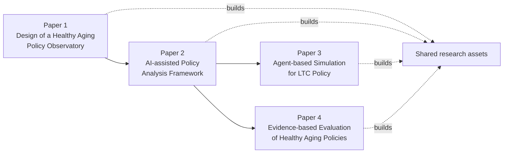
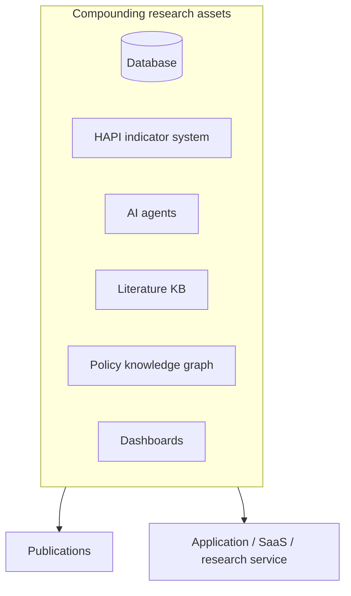

# 09 — Research Roadmap

## 中文概览

本文把平台和研究计划绑在一起:不是做四个互不相关的课题,而是围绕**同一个平台**不断深化,几年下来沉淀出一套可复用的研究资产。

- **四篇论文主线**:
  1. *Design of a Healthy Aging Policy Observatory* —— 平台与方法学设计(本白皮书即其基础)。
  2. *AI-assisted Policy Analysis Framework* —— AI 辅助政策分析框架(模块④⑤)。
  3. *Agent-based Simulation for Long-term Care Policy* —— LTC 政策的基于主体的仿真。
  4. *Evidence-based Evaluation of Healthy Aging Policies* —— 用准实验设计做实证评估(模块④)。
- **研究资产台账**:数据库、指标体系(HAPI)、AI Agent、文献知识库、政策知识图谱、可视化看板——每篇论文都在往这套资产里"存钱",也从中"取钱"。
- **价值**:论文与实际应用(SaaS/研究服务)由同一套资产同时支撑。

---

## 1. One platform, four papers

The strategic point of the observatory: instead of four disconnected theses, the research arc *deepens a single platform*. Each paper consumes platform assets and deposits new ones.

| Paper | Thesis | Primarily exercises | Depends on |
|-------|--------|---------------------|------------|
| **1. Design of a Healthy Aging Policy Observatory** | The architecture + HAPI methodology as a reproducible research instrument | Modules ①②③; data model; HAPI method | *This whitepaper is its foundation* |
| **2. AI-assisted Policy Analysis Framework** | A grounded, cited AI workflow for policy analysis & review | Modules ④⑤ | Paper 1's corpus + indicators |
| **3. Agent-based Simulation for LTC Policy** | Simulating LTC policy effects via agent-based models | Analytics + HAPI as calibration/validation targets | Papers 1–2 data & indicators |
| **4. Evidence-based Evaluation of Healthy Aging Policies** | Rigorous quasi-experimental evaluation of real policies | Module ④ (ITS/DiD/SC) | Papers 1–2 corpus, indicators, analytics |

> Sequencing is indicative, not rigid: Paper 1 is the foundation; Papers 2–4 can proceed as the corresponding modules mature.

## 2. How each paper feeds the platform

- **Paper 1** establishes the **data model, the curated NS+Federal corpus, and HAPI v1** — the bedrock everything else stands on.
- **Paper 2** hardens the **AI retrieval/synthesis workflow** (Module ⑤) and the analytics framing (Module ④), producing reusable agent tooling and prompts.
- **Paper 3** adds an **agent-based simulation** capability calibrated against HAPI indicators, deepening the analytics layer and the LTC focus tied to the author's work.
- **Paper 4** produces **concrete, rigorous evaluations** (ITS/DiD/synthetic control) that both publish findings and stress-test the analytics guardrails from [`07-module-policy-analytics.md`](07-module-policy-analytics.md).

## 3. The research-asset ledger

Every cycle deposits assets that compound — supporting *both* publication and the SaaS/research-service venture:

| Asset | Built/extended by | Reused for |
|-------|-------------------|------------|
| **Database** (policies, indicators, observations) | Papers 1, 4 | All analyses, dashboards, SaaS |
| **Indicator system (HAPI)** | Paper 1 | Papers 3, 4; dashboards; auto-scoring |
| **AI agents** (retrieval, summarization, review) | Paper 2 | Assistant; future products |
| **Literature knowledge base** | Paper 2 | All literature reviews |
| **Policy knowledge graph** (policies ↔ indicators ↔ outcomes) | Papers 1–2 | Analytics; assistant; explainability |
| **Visualization dashboards** | Papers 1, 4 | SaaS surface; public/media outputs |

## 4. Why this beats four separate projects

- **Compounding, not restarting.** Each paper starts from the prior one's assets instead of from zero.
- **Coherent narrative.** A reviewer (or a customer) sees one credible program, not scattered one-offs.
- **Dual payoff.** The same assets that make papers possible make a product possible — directly serving the venture goal in [`00-vision.md`](00-vision.md).
- **Anchored in LTC + Nova Scotia.** The arc stays tied to the author's domain expertise and a real, expandable jurisdiction.

## 5. Near-term research milestones

1. **Submit/share Paper 1's design** once the v1 build (per [`11-implementation-roadmap.md`](11-implementation-roadmap.md)) demonstrates the data model + HAPI on NS+Federal.
2. **Draft Paper 2** as the AI assistant + analytics framework reach a working, cited end-to-end flow.
3. **Scope Papers 3–4** against the maturing indicator set and corpus.
