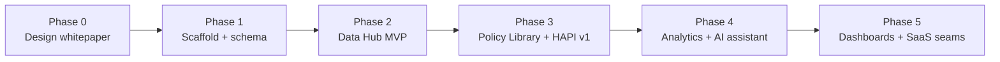

# 11 — Implementation Roadmap

## 中文概览

本文把白皮书落到可执行的分阶段计划。原则:**先打地基(数据模型+血缘+HAPI 方法),再逐模块加宽**,每个阶段都产出可演示、可复现的东西。

- **阶段 0**:设计白皮书(本仓库)。✅
- **阶段 1 — 脚手架** ✅:建 monorepo(`apps/web` + `pipeline` + `db` + `packages`)、docker-compose 起 Postgres、落地 [`03`](03-data-model.md) 的 schema 与迁移。
- **阶段 2 — Data Hub 最小闭环** ✅:为 Care Access 优先的少量源写连接器,跑通 采集→清洗→入库(不可变 Observation + DatasetVersion),含质量校验。
- **阶段 3 — Policy Library + HAPI** ✅:种入 NS+联邦政策(AI 摘要+抽取+人工复核),定义 HAPI v1 指标集并算出 NS/联邦域得分。
- **阶段 4 — Analytics + AI 助手** ✅:Tier-1 描述性分析 + 一个完整 ITS 示例;RAG 检索+带引用的文献综述草稿。
- **阶段 5(当前)— 看板与对外** ✅:Next.js 跨模块研究者看板(KPI、各管辖区 HAPI 快照、最新政策与发现、管辖区树)+ 统一顶部导航;为未来 SaaS 预留鉴权接缝(`lib/access.ts`)与可空 `org_id` 多租户接缝(暂不开启)。

每阶段的"完成定义(DoD)"强调可复现与可溯源。

---

## 1. Principles

1. **Foundation before breadth.** Get the data model, lineage, and HAPI *method* right on a narrow slice, then widen.
2. **Every phase is demonstrable & reproducible.** No phase is "done" until its output re-runs to the same result and traces back to sources.
3. **Care Access first.** It maps to the author's LTC work and to high-signal CIHI/IRRS + NS data ([`10-data-sources-catalog.md`](10-data-sources-catalog.md)).
4. **Researcher-first surfaces.** Dashboards/SaaS come after a credible research core ([`01-platform-overview.md`](01-platform-overview.md) §4).

## 2. Phases

### Phase 0 — Design whitepaper ✅ (this repository)
- **Deliverable:** the `docs/` whitepaper + README. Foundation for Paper 1.
- **DoD:** modules, data model, HAPI method, sources, and roadmap documented and internally consistent.

### Phase 1 — Scaffold + schema ✅
- Create the monorepo per [`02-architecture.md`](02-architecture.md) §2: `apps/web` (Next.js/TS), `pipeline` (Python), `db` (schema + migrations), `packages/contracts`.
- `docker-compose.yml` for local Postgres.
- Implement the [`03-data-model.md`](03-data-model.md) schema as migrations under `db/migrations`; seed the `Jurisdiction` tree (Canada → Federal / Nova Scotia).
- **DoD:** `docker-compose up` + migrate yields an empty but correct database; web app boots and reads the jurisdiction tree.

### Phase 2 — Data Hub MVP ✅
- Build connectors (`pipeline/ingest/`) for a **Care-Access-first** subset: StatCan WDS (denominators + relevant tables), one NS Open Data source, and a CIHI/IRRS public table.
- Implement transform → validate → load with **immutable Observations + DatasetVersion** and the quality checks from [`05-module-data-hub.md`](05-module-data-hub.md).
- **DoD:** a value on a chart can be traced to `Observation → DatasetVersion → DataSource`; a re-run with unchanged upstream is a no-op.

### Phase 3 — Policy Library + HAPI v1 ✅
- Seed a meaningful **NS + Federal** policy set (home care, LTC, dementia, seniors' financial supports) via the AI-assisted curation pipeline ([`04-module-policy-library.md`](04-module-policy-library.md)), with human review and lifecycle status.
- Define **HAPI v1** indicators (all six required attributes; weighted toward Care Access + Health) and compute NS/Federal domain scores over time ([`06-module-indicators-hapi.md`](06-module-indicators-hapi.md)), storing `method_version` v1.
- Link policies to indicators (`policy_indicator`).
- **DoD:** browse the policy timeline; see HAPI domain scores for NS + Federal with every score auditable to its inputs.

### Phase 4 — Analytics + AI assistant ✅
- Tier-1 descriptive analytics (trends, policy-event overlays, correlations) + **one fully worked ITS** example with assumptions/limitations, using the `Association`/`Causal` tagging ([`07-module-policy-analytics.md`](07-module-policy-analytics.md)).
- AI assistant: retrieval over Policy Library + indicators + a starter literature set; "topic → evidence pack + cited draft review" for the NS dementia / home-care scenarios, with citation-on-every-claim ([`08-module-ai-research-assistant.md`](08-module-ai-research-assistant.md)).
- **DoD:** "I want to study NS dementia policy" returns a sourced, cited draft; the ITS example reproduces and is correctly tagged.

### Phase 5 — Dashboards + SaaS seams ✅
- Next.js dashboards: a cross-cutting researcher dashboard at `/` (KPI strip, per-jurisdiction HAPI snapshot, recent policies, recent findings, jurisdiction tree) plus a shared top nav across every module; the per-module surfaces (policy timeline, HAPI by domain/jurisdiction, analytics views) land in Phases 3–4.
- Wired the **auth seam** ([`apps/web/lib/access.ts`](../apps/web/lib/access.ts): `getAccessContext` + `orgScope`) and **tenancy-ready** nullable `org_id` ([`db/migrations/0004`](../db/migrations/0004_tenancy_org_id.sql)) per [`02-architecture.md`](02-architecture.md) §5 — every org-scoped read routes through the seam, but multi-tenancy stays off (no-op single-tenant today).
- **DoD:** a usable researcher-facing dashboard; a clear, additive path to Stage-2/3 SaaS. ✅

## 3. Phase → module → paper mapping

| Phase | Modules exercised | Feeds paper |
|-------|-------------------|-------------|
| 1 | data model | Paper 1 |
| 2 | ② Data Hub | Paper 1 |
| 3 | ① Policy Library, ③ HAPI | Paper 1 |
| 4 | ④ Analytics, ⑤ AI Assistant | Papers 2 (and 4) |
| 5 | dashboards | venture / all papers |

(See [`09-research-roadmap.md`](09-research-roadmap.md) for the paper arc.)

## 4. Cross-cutting "definition of done" (every phase)

- **Reproducible:** re-runs yield identical results or show exactly what changed.
- **Traceable:** every number → source; every AI claim → citation.
- **Honest:** association vs. causal clearly labeled.
- **Extensible:** adding a province/source is additive (rows + one connector), not a schema change.

## 5. Immediate next step after this whitepaper

Begin **Phase 1** (scaffold + schema) on a feature branch: stand up the monorepo, `docker-compose` Postgres, and the `db/migrations` implementing [`03-data-model.md`](03-data-model.md) with the seeded jurisdiction tree. This is the smallest step that turns the design into running infrastructure.
