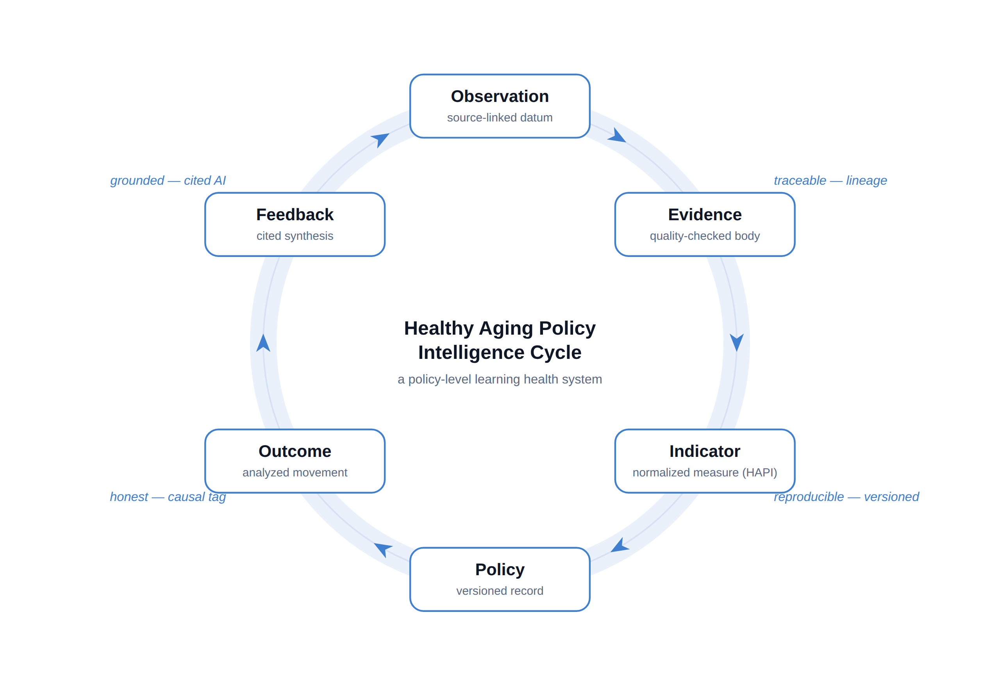
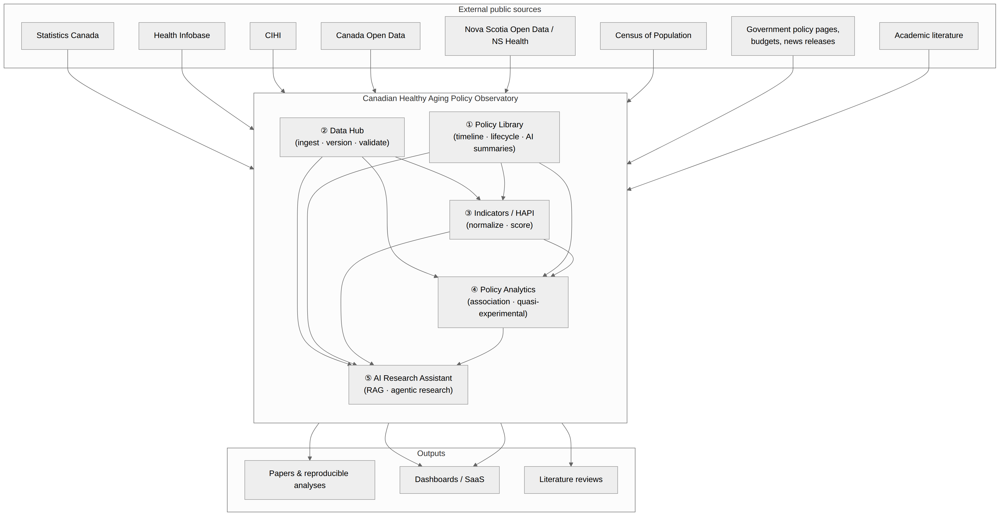
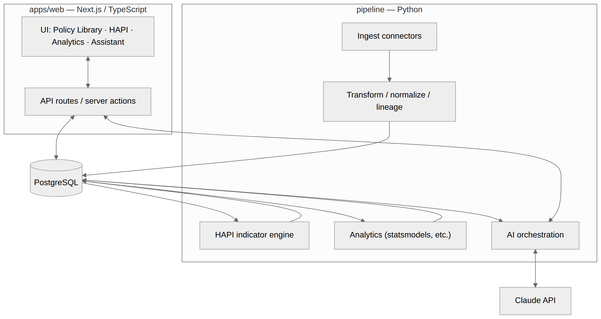
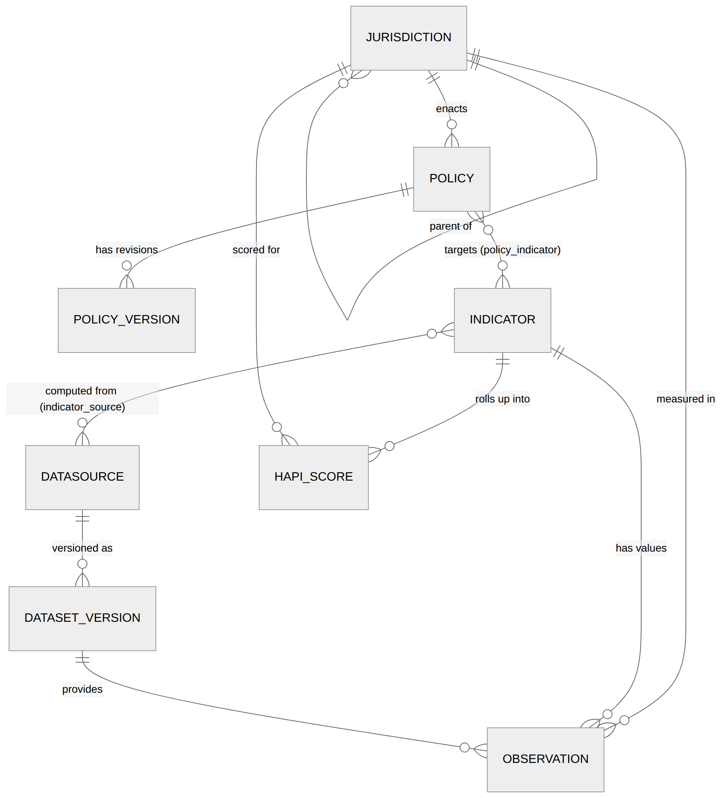

# Design of a Reproducible Healthy Aging Policy Observatory: Infrastructure for Trustworthy Aging-Policy Evidence in Canada

**Quangui Huang (Giorgio)**¹

¹ Healthy Aging Intelligence Lab (HAIL). Correspondence via
https://github.com/GiorgioHuang/aging-policy-lab

*Preprint. Draft — not peer reviewed.*

---

## Abstract

The evidence base for aging policy suffers less from a shortage of analysis than
from a shortage of *trustworthy infrastructure*: policy text and outcome data live
apart, published numbers rarely trace to their sources, and descriptive co-movement
is routinely dressed as causation. **We argue these are infrastructure problems, not
analysis problems** — and that the response is a reproducible research instrument, an
*observatory*, rather than another dashboard. We frame the design around a conceptual
model, the **Healthy Aging Policy Intelligence Cycle** (Observation → Evidence →
Indicator → Policy → Outcome → Feedback) — a policy-level instance of a Learning
Health System — and ask four design-evaluation questions: can every published number
be traced to its exact source (provenance); does the pipeline reproduce identical
results (reproducibility); can the AI layer emit an ungrounded citation (grounding);
and are composite comparisons robust to method choices (robustness). We present the
Canadian Healthy Aging Policy Observatory, whose data model makes provenance
structural (immutable observations bound to versioned, content-addressed dataset
snapshots) and whose analytics enforce an association-versus-causation distinction in
software. Instantiated on Nova Scotia and the federal level with a Care Access focus,
the instrument answers the design questions affirmatively: 100% of published values
resolve to an upstream source, the pipeline reproduces deterministically from
committed inputs, the assistant cannot cite outside a fixed evidence pack, and the
headline index ordering is invariant across three weighting schemes (composite spread
2.9 points). **The design itself is the contribution**: a reproducible, provenance-first
observatory is a durable paradigm for aging-policy evidence that compounds across a
multi-paper program, in which the index methodology, the grounded-AI framework, and
the causal-evaluation studies are each deepened in their own right.

**Keywords:** healthy aging, health informatics, learning health system, policy
evaluation, reproducible research infrastructure, data provenance, composite
indicators, interrupted time series, retrieval-augmented generation, Nova Scotia.

---

## 1. Introduction

### 1.1 The problem is infrastructure, not analysis

Canada, like most high-income countries, is aging quickly, and governments at every
level respond with policy — home-care investment, long-term-care (LTC) capacity,
dementia strategies, seniors' income supports, digital-inclusion programs. Yet the
machinery for *evaluating* those policies lags the machinery for *announcing* them.
Three gaps recur:

1. **Fragmentation.** Policy text, budgets, and target populations live in press
   releases and PDFs; outcome data live in separate agencies (Statistics Canada, the
   Canadian Institute for Health Information, provincial open-data portals). Nothing
   links a policy to the indicators it was meant to move.
2. **Irreproducibility.** Published dashboards and reports rarely let a reader trace a
   headline number to the specific upstream table, vintage, and transformation that
   produced it; re-running an analysis a year later often yields a different number
   for unstated reasons.
3. **Causal overreach.** Descriptive co-movement ("spending rose and ED visits fell")
   is routinely presented in language implying causation, without the design or
   assumptions that would justify it.

Our central claim is that **these are infrastructure problems, not analysis
problems.** No new estimator fixes a number that cannot be traced to its source, an
analysis that cannot be reproduced, or a claim whose causal status is ambiguous by
default. What is missing is a standing, reproducible *instrument* — an **observatory**
— that continuously ingests policies and outcomes, quantifies them with a documented
and versioned method, and makes honest inference the path of least resistance. The
distinction is the one astronomy draws between a telescope and a press photo: the
value is in the instrument's reliability and in the fact that others can point it
themselves.

### 1.2 Why an aging-policy observatory is health informatics

Policy is an upstream determinant of health: home-care funding, LTC staffing, and
income supports shape the functional ability, independence, and outcomes of older
adults as surely as any bedside intervention. Health informatics has correspondingly
broadened from clinical decision support toward **population- and policy-level**
decision support and **knowledge translation** — turning evidence into actionable,
traceable syntheses for decision-makers. The observatory is precisely such an
instrument, and its design mirrors a core health-informatics idea: the **Learning
Health System** (LHS) [11], in which data generate knowledge that improves practice
and thereby generates new data, in a continuous loop. Where a clinical LHS closes that
loop around care delivery, the observatory closes it around *policy* — an LHS for
healthy-aging governance. Reading the design through evidence, knowledge translation,
and decision support is what makes it a health-informatics contribution rather than a
software-engineering one.

### 1.3 Research questions

Because the contribution is a design, we evaluate it as a design. We ask four
**design-evaluation questions** whose answers are properties of the artifact, not
outcomes of a clinical trial:

- **RQ1 (Provenance).** Can every published quantitative value be traced to the exact
  upstream source it came from?
- **RQ2 (Reproducibility).** Does the pipeline reproduce identical results from the
  same inputs, and is ingestion idempotent under unchanged upstream data?
- **RQ3 (Grounding).** Can the AI layer emit a factual claim or citation that is not
  grounded in a fixed, visible evidence set?
- **RQ4 (Robustness).** Are the composite index's headline comparisons robust to its
  most contestable method choice, the domain weighting?

§7 answers each with evidence from the instantiated instrument.

### 1.4 Contribution

The primary contribution of this paper is **the design of a reproducible healthy-aging
policy observatory, together with the conceptual framework it realizes** — the Healthy
Aging Policy Intelligence Cycle (§3). The design's defining commitments are provenance
as a structural property, reproducibility by construction, and an
association/causation discipline enforced in software. The observatory *instantiates*
three modules — a documented composite index (HAPI), a quasi-experimental analytics
layer, and a grounded AI research assistant — but these are presented here as evidence
that the framework runs end-to-end, not as the paper's contribution; each is the
subject of its own paper in the program (§8). This scoping is deliberate: a single,
well-evaluated design claim is worth more than an inventory of subsystems.

## 2. Related work

**Learning health systems and health-informatics infrastructure.** The LHS concept
[11] frames continuous improvement as a data→knowledge→practice→data cycle; most LHS
work targets clinical care. We extend the idea *upstream* to policy, and we take
seriously the informatics infrastructure — provenance, versioning, reproducibility —
that an LHS presupposes but often under-specifies. Our data-stewardship commitments
follow the FAIR principles [9].

**Composite indices of aging.** The WHO *World Report on Ageing and Health* [1] and the
*Decade of Healthy Ageing* [2] articulate intrinsic capacity and functional ability;
the European Active Ageing Index [5] and HelpAge's Global AgeWatch Index [4]
operationalize domains into composite scores. HAPI is in this tradition but is
policy-facing, reproducible by construction, and transparent about its own weighting;
its methodology is developed in full in Paper 2 (§8) and appears here only as an
instantiated module. We follow OECD/JRC guidance [3] on transparency and sensitivity
analysis.

**Policy monitors and quasi-experimental evaluation.** Government/NGO trackers catalog
policies but seldom integrate outcomes or support inference; academic evaluations
produce rigorous single-policy studies but rarely as reusable infrastructure. The
segmented-regression interrupted-time-series literature [6, 7, 8] provides the
reference designs; the observatory operationalizes them under an explicit tagging
discipline and defers their empirical application to Paper 4.

**LLMs for policy analysis.** Retrieval-augmented generation (RAG) [10] makes it
feasible to draft grounded syntheses over a fixed corpus; the risk is fabricated
citations and unsupported claims. Our assistant constrains the model to cite *only*
items in a pre-assembled evidence pack, making fabrication structurally detectable;
the framework is developed in Paper 3.

## 3. Conceptual framework: the Healthy Aging Policy Intelligence Cycle

The design is organized by a conceptual model that doubles as its theory of value.
Healthy-aging policy intelligence is a cycle of six stages (Figure 1):

> **Figure 1.** The Healthy Aging Policy Intelligence Cycle. Six stages form a closed
> loop; the italic labels mark the four points where the design hardens trust
> (traceability, reproducibility, causal honesty, and grounding).

- **Observation** — an immutable, source-linked datum ingested from an upstream table.
- **Evidence** — observations assembled and quality-checked into an interpretable
  body, with literature and prior findings.
- **Indicator** — evidence normalized into a documented, comparable measure (HAPI).
- **Policy** — a versioned policy record linked to the indicators it intends to move.
- **Outcome** — the movement of indicators over time, analyzed under an
  association/causation discipline.
- **Feedback** — findings and syntheses returned to researchers and policymakers,
  which motivate new observations, closing the loop.

Two properties make this more than a diagram. First, it is a **policy-level Learning
Health System** [11]: each turn of the cycle converts data into knowledge that informs
policy and thereby generates new data. Second, it names exactly the points where trust
is usually lost — the arrows — and the design hardens each: Observation→Evidence is
made *traceable* (lineage), Indicator is made *reproducible and version-stamped*,
Outcome is made *honest* (causal tagging), and Feedback is made *grounded* (cited AI).
The five platform modules (§4) are the machinery that turns this cycle; the rest of the
paper shows the machinery exists, runs, and can be trusted.

## 4. System design

### 4.1 Modules as cycle stages

The Observatory is five modules over one database and one provenance discipline
(Figure 2), each realizing part of the cycle:

1. **Policy Library** (Policy) — a jurisdiction-aware, time-stamped, versioned record
   of aging policies: department, budget, target population, lifecycle, themes, and
   AI-assisted summaries.
2. **Data Hub** (Observation → Evidence) — connectors that ingest open data into
   immutable observations with full lineage and automated quality checks.
3. **Indicators / HAPI** (Indicator) — a documented composite over six domains,
   computed from observations and stored with a method version.
4. **Policy Analytics** (Outcome) — descriptive trends and quasi-experimental designs
   under an explicit association/causation tag.
5. **AI Research Assistant** (Feedback) — retrieval over the platform's own stores that
   produces cited evidence packs and draft reviews.

> **Figure 2.** System context: external public sources flow into the five
> Observatory modules, which produce papers, dashboards, and literature reviews.
> (Source: [`docs/01-platform-overview.md`](../../docs/01-platform-overview.md).)

### 4.2 Architecture

The platform is a monorepo (Figure 3): a **Next.js/TypeScript** web app (`apps/web`)
for the researcher-facing surfaces; a **Python** pipeline (`pipeline/hapi_pipeline`)
for ingestion, scoring, and analysis; a **PostgreSQL** schema with forward-only
migrations (`db/`); and a shared contracts package. The pipeline is the reproducible
core (deterministic transforms, versioned method); the web app is a read-mostly view
over what the pipeline produced. A number in the UI is never computed in the browser —
it renders a stored, lineage-bearing record. The AI layer wraps a hosted LLM behind
narrow, audited entry points, and every generation is logged.

> **Figure 3.** Architecture: the Python pipeline writes to PostgreSQL (raw →
> transformed → indicators → analytics); the Next.js app reads those tables and
> invokes the AI layer. (Source:
> [`docs/02-architecture.md`](../../docs/02-architecture.md).)

### 4.3 Design principles

*Foundation before breadth* (get the model, lineage, and method right on a narrow
slice, then widen additively); *every artifact is demonstrable and reproducible*; and
*researcher-first* (public/decision-support surfaces follow a credible research core).

## 5. Data model: making provenance structural

The schema (Figure 4) centers on entities that make provenance and reproducibility
*structural* rather than conventional:

- **Jurisdiction** — a hierarchical tree (Canada → Federal / Nova Scotia → …); adding a
  province is a row, not a schema change.
- **Policy / policy_version** — versioned policy records linked to a jurisdiction.
- **Indicator** — the definition of a measure: meaning, unit, normalization, per-capita
  rule.
- **DataSource** — upstream provider metadata (agency, licence, cadence, access
  method).
- **DatasetVersion** — a specific *retrieval*: timestamp + content **checksum**, the
  unit of idempotency.
- **Observation** — an immutable (jurisdiction × indicator × time) value bound to its
  DatasetVersion; never mutated — a new vintage yields a new version and new
  observations.
- **hapi_score** — a computed domain/composite score at a given `method_version`.
- **policy_indicator, indicator_source** — the many-to-many links that make the
  platform a small knowledge graph.
- **analysis_finding, literature** — analytic results (tier-tagged) and the literature
  knowledge base.

The key property is the **lineage chain**: every value resolves as
`Observation → DatasetVersion → DataSource`. Because observations are immutable and
dataset versions are content-addressed, analyses are reproducible and ingestion is
idempotent (re-ingesting unchanged upstream data is a no-op). This is what lets the
platform claim any published number is auditable to the exact upstream table it came
from — and it is what §7 evaluates directly (RQ1, RQ2).

> **Figure 4.** Entity–relationship model. Every value resolves along the lineage
> chain Observation → DatasetVersion → DataSource; indicators roll up into HAPI
> scores. (Source: [`docs/03-data-model.md`](../../docs/03-data-model.md).)

## 6. Instantiating the cycle

To show the framework runs end-to-end, the Observatory instantiates its three
analytical stages. We summarize each here as evidence; the full methodology of each is
the subject of its own paper (§8).

**Indicator — HAPI.** The Healthy Aging Policy Index scores how well a jurisdiction
supports healthy aging (0–100) across six domains (Health, Independence, Social
Participation, Financial Security, Care Access, Digital Inclusion). Each indicator
declares a direction, a min-max normalization against a documented reference range,
and, for counts, a per-capita rule; the composite is a weighted mean over available
domains, renormalized by the domains present. Crucially, weighting — the most
contestable step — is treated as an auditable object: three schemes (equal; a
theory-anchored *expert* tier from the WHO [1] and AgeWatch [4] frameworks; and an
*empirical*, coefficient-of-variation scheme) are reported side by side per OECD/JRC
guidance [3], and every score carries a `method_version`. *The index's methodology,
validation, and sensitivity analysis are developed fully in Paper 2.*

**Outcome — analytics under a causal discipline.** Results are two-tier and always
labelled. **Tier 1 (Association)**: trends, policy-event overlays, correlations. **Tier
2 (Causal)**: quasi-experimental designs — interrupted time series (ITS),
difference-in-differences, synthetic control — each carrying its assumptions as
attached metadata. The reference Tier-2 design is segmented-regression ITS [7, 8] with
Newey–West (HAC) inference [6]; it refuses to report coefficients below three points
per segment, returning an explicit `insufficient_data` status instead. A finding is
tagged `Causal` *only* together with its named assumptions, never upgraded silently
from an association. *The empirical evaluations are the subject of Paper 4.*

**Feedback — grounded AI assistant.** Given a topic, the assistant retrieves an
**evidence pack** (policies `P#`, literature `L#`, findings `F#`) from the platform's
own stores, then drafts a review *from that exact pack* under a contract: every claim
ends with a citation tag resolving to a pack item; only the pack may be used; analytic
tiers are preserved, never upgraded; the output is a draft for a human, not a verdict.
Because the pack is fixed and visible, a fabricated citation is structurally detectable,
and every generation is logged. *The grounded-AI framework is developed in Paper 3.*

## 7. Design evaluation

We evaluate the design against the four research questions, using the instrument
instantiated on Nova Scotia (CA-NS) and the federal level (CA) with a Care Access
focus. Unless noted, results reproduce deterministically from committed fixtures
(captured from real upstream tables) via `ingest → score → analyze → paper-tables`;
the production deployment runs the same connectors against live sources. The
instantiated corpus:

| Asset | Count |
|---|---:|
| Policies | 26 |
| Indicators (distinct, observed) | 34 |
| Observations | 231 |
| Dataset versions | 17 |
| Data sources | 17 |
| HAPI scores | 100 |
| Analytic findings | 3 |
| Literature references | 7 |
| Jurisdictions | 3 |

**RQ1 — Provenance: can every number be traced?** Yes. Every one of the 231
observations is bound to a DatasetVersion (17) and thence a DataSource (17); every HAPI
score and figure is computed from those observations; and the Data Hub renders the full
`Observation → DatasetVersion → DataSource` chain for each value. Traceability is not a
sampled audit but a structural invariant of the schema (§5): a value that lacks lineage
cannot be stored. *Result: 100% of published quantitative values are source-traceable.*

**RQ2 — Reproducibility: does the pipeline reproduce, idempotently?** Yes. The
transforms are deterministic, so the same inputs yield identical scores and findings;
re-ingesting unchanged upstream data is a no-op because dataset versions are
content-addressed by checksum. The evaluation corpus above regenerates from committed
fixtures with a single command, which is how the numbers in this paper were produced.
*Result: deterministic reproduction; idempotent ingestion.*

**RQ3 — Grounding: can the AI emit an ungrounded citation?** No, by construction. The
assistant may cite only ids present in the pre-assembled evidence pack; any tag that
does not resolve to a pack item is detectable as fabrication, and every generation is
logged for audit. Grounding is therefore a property of the retrieval-then-constrain
design rather than of model behavior. *Result: zero ungrounded citations are
representable; violations are structurally detectable.*

**RQ4 — Robustness: are index comparisons robust to weighting?** Yes. Under the three
schemes, the composite for each jurisdiction at its latest period is:

| Jurisdiction | Period | equal | expert | empirical |
|---|---|---:|---:|---:|
| CA (federal) | 2024 | 43.2 | 41.7 | 44.6 |
| CA-NS (Nova Scotia) | 2026 | 50.1 | 50.1 | 50.1 |

The **maximum composite spread across schemes is 2.9 points**, and the NS-above-federal
ordering holds under all three weightings — so the headline comparison does not hinge on
the weighting choice. For completeness, the computed v1 domain profiles (latest
available score per domain) are:

| Jurisdiction | Overall | Health | Independence | Social Part. | Financial Sec. | Care Access | Digital Incl. |
|---|---:|---:|---:|---:|---:|---:|---:|
| CA (federal) | 42 | 48 | 46 | 50 | 56 | 28 | 72 |
| CA-NS (Nova Scotia) | 50 | 38 | 44 | 69 | 21 | 50 | 59 |

**Causal discipline in action.** The three ITS designs illustrate the Outcome-stage
guarantee: two attached to real NS policies return `insufficient_data` (1/3 and 5/2
points per segment — below the threshold), so no coefficients are asserted; a third,
adequately-covered illustrative series (5/5) yields a significant downward slope change
(−715.7; 95% CI −1125.1..−306.3; p < 0.001; R² = 0.934), reported as **Causal(ITS)**
only alongside its four assumptions. That the platform *demonstrates a design without
estimating an effect on thin data* is the honesty property, evaluated live.

Together these answer the design questions affirmatively: the observatory is
traceable, reproducible, grounded, and robust — the properties the Intelligence Cycle
(§3) identifies as where trust is won or lost.

## 8. The research program

Scoping Paper 1 to the observatory design lets each analytical module be developed as a
focused study that both deepens and reuses the platform:

| Paper | Contribution | Instantiates |
|---|---|---|
| **1 (this paper)** | Design of a reproducible healthy-aging policy observatory + the Policy Intelligence Cycle | Research infrastructure |
| **2** | The HAPI methodology — a transparent, sensitivity-tested composite-indicator framework | Indicator stage |
| **3** | AI-assisted policy intelligence — grounded retrieval + evidence synthesis | Feedback stage |
| **4** | Causal evaluation of Canadian aging policies — ITS / DiD / synthetic control | Outcome stage |

Each paper deposits assets back into the platform (a curated corpus, a validated index,
reusable agent tooling, worked evaluations), so the program compounds rather than
restarts — the strategic point of building an instrument rather than a study.

## 9. Limitations and ethics

**Limitations.** (1) *Coverage.* With two jurisdictions, the empirical weighting and any
cross-jurisdiction inference are indicative; the design's value is in the method and
its additive extensibility. (2) *Normalization ranges are choices.* Min-max reference
ranges are documented and contestable; RQ4's robustness check mitigates but does not
eliminate this — a composite index is a lens, not a measurement. (3) *Causal
identification.* ITS and related designs rest on assumptions (no coincident shocks,
correct functional form) that real timelines strain; thin data may permit only
*demonstrating* a design, which the platform reports honestly. (4) *Design evaluation,
not outcome evaluation.* We evaluate whether the instrument is trustworthy (RQ1–RQ4),
not whether any policy improved health — the latter is Paper 4's task.

**Ethics.** The platform uses aggregate, published statistics, not individual records,
and respects Canada's federal privacy law (PIPEDA) as a baseline. Most importantly, the
design encodes an ethic of *epistemic honesty*: association is never dressed as
causation, index choices are exposed for scrutiny, and AI output is grounded and cited
by construction. For infrastructure that may inform decisions about a vulnerable
population, that honesty is a safety property.

## 10. Conclusion

We have argued that the weaknesses of aging-policy evidence are infrastructure problems,
not analysis problems, and presented the design of a reproducible observatory that
treats them as such — organized by the Healthy Aging Policy Intelligence Cycle, a
policy-level Learning Health System. Evaluated as a design, the instrument is
traceable (100% of values source-linked), reproducible (deterministic, idempotent),
grounded (no representable ungrounded citation), and robust (index ordering invariant
to weighting, spread 2.9 points). The contribution is the design itself: a durable
paradigm for trustworthy aging-policy evidence, on which a focused program of
methodology, grounded-AI, and causal-evaluation papers builds.

## Acknowledgements

This work uses publicly available data from Statistics Canada, the Canadian Institute
for Health Information (CIHI), and the Nova Scotia Open Data portal; we thank these
providers for open access to the underlying tables. The author received no specific
funding for this work.

## Data and code availability

The platform — schema, pipeline, methodology, and web application — is developed in the
open at https://github.com/GiorgioHuang/aging-policy-lab. Every quantitative result
reproduces from the pipeline commands in the paper's repository README.

## 11. References

*Aging frameworks and composite indices.*

1. World Health Organization. *World Report on Ageing and Health.* Geneva: WHO, 2015.
   ISBN 978-92-4-156504-2.
2. World Health Organization. *Decade of Healthy Ageing 2021–2030.* Geneva: WHO, 2020.
3. Nardo, M., Saisana, M., Saltelli, A., Tarantola, S., Hoffmann, A., & Giovannini, E.
   *Handbook on Constructing Composite Indicators: Methodology and User Guide.* Paris:
   OECD Publishing, 2008. doi:10.1787/9789264043466-en.
4. HelpAge International. *Global AgeWatch Index 2015: Insight Report.* London: HelpAge
   International, 2015.
5. Zaidi, A., Gasior, K., Hofmarcher, M. M., Lelkes, O., Marin, B., Rodrigues, R.,
   Schmidt, A., Vanhuysse, P., & Zolyomi, E. *Active Ageing Index 2012: Concept,
   Methodology and Final Results.* Vienna: European Centre, 2013.

*Quasi-experimental methods (interrupted time series).*

6. Newey, W. K., & West, K. D. "A Simple, Positive Semi-Definite, Heteroskedasticity
   and Autocorrelation Consistent Covariance Matrix." *Econometrica*, 55(3), 703–708,
   1987. doi:10.2307/1913610.
7. Wagner, A. K., Soumerai, S. B., Zhang, F., & Ross-Degnan, D. "Segmented regression
   analysis of interrupted time series studies in medication use research." *Journal of
   Clinical Pharmacy and Therapeutics*, 27(4), 299–309, 2002.
   doi:10.1046/j.1365-2710.2002.00430.x.
8. Lopez Bernal, J., Cummins, S., & Gasparrini, A. "Interrupted time series regression
   for the evaluation of public health interventions: a tutorial." *International
   Journal of Epidemiology*, 46(1), 348–355, 2017. doi:10.1093/ije/dyw098.

*Learning health systems, reproducible infrastructure, and grounded generation.*

9. Wilkinson, M. D., Dumontier, M., Aalbersberg, Ij. J., et al. "The FAIR Guiding
   Principles for scientific data management and stewardship." *Scientific Data*, 3,
   160018, 2016. doi:10.1038/sdata.2016.18.
10. Lewis, P., Perez, E., Piktus, A., Petroni, F., Karpukhin, V., Goyal, N., Küttler,
    H., Lewis, M., Yih, W., Rocktäschel, T., Riedel, S., & Kiela, D.
    "Retrieval-Augmented Generation for Knowledge-Intensive NLP Tasks." *NeurIPS* 33,
    2020. arXiv:2005.11401.
11. Friedman, C. P., Wong, A. K., & Blumenthal, D. "Achieving a Nationwide Learning
    Health System." *Science Translational Medicine*, 2(57), 57cm29, 2010.
    doi:10.1126/scitranslmed.3001456.

*Primary data sources.*

12. Statistics Canada. Data accessed via the Web Data Service (WDS). Tables used
    include 13-10-0971-01 (health-adjusted life expectancy), 13-10-0096-01 (Canadian
    Community Health Survey — health characteristics), 13-10-0374-01 (Canadian Survey
    on Disability), 13-10-0789-01 (Canadian Health Survey on Seniors — ADL),
    11-10-0135-01 (low-income statistics), and 14-10-0202-01 (employment by industry,
    SEPH). *[TODO: confirm each table's exact vintage as cited in the Data Hub.]*
13. Canadian Institute for Health Information (CIHI). Integrated interRAI Reporting
    System (IRRS) and long-term-care data holdings. Ottawa: CIHI.
14. Government of Nova Scotia. Nova Scotia Open Data Portal — including the LTC
    placement waitlist (c39g-gsdd) and the LTC facilities directory (x76a-axw2).
    data.novascotia.ca.
